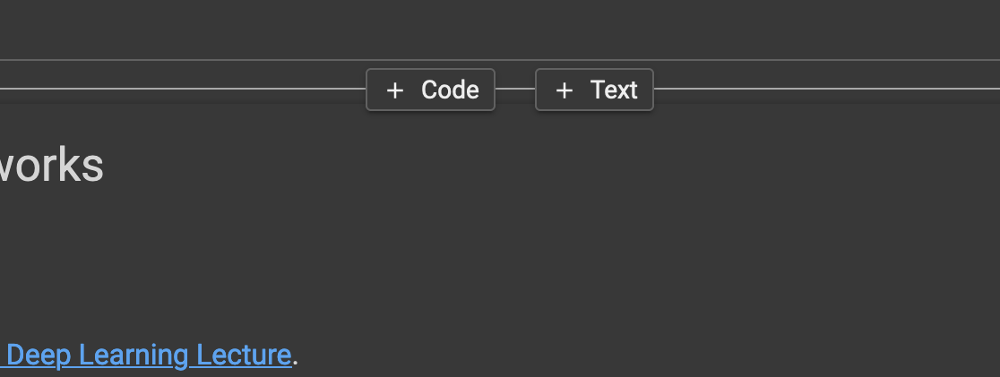
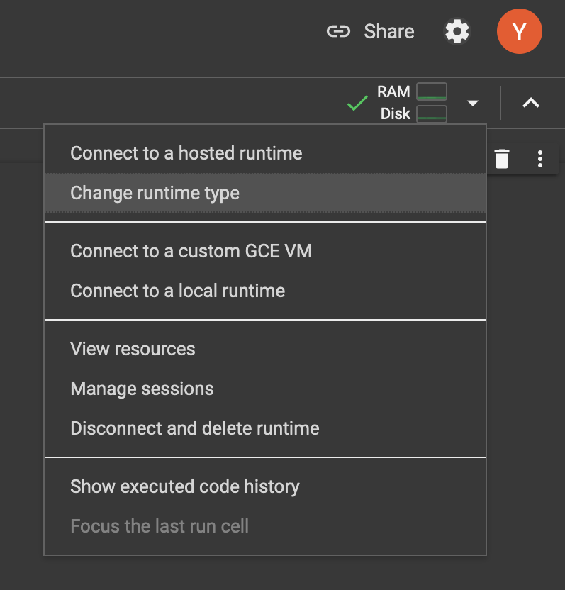

# MLOps

This is the repository for the labs/tutorials of a course about Machine Learning Operations (MLOps), ZHAW.

**NOTE:** Labs might still be in the process of being updated, please refresh right before the corresponding lab is touched in the lecture!

## Table of Contents

| Lab No. | Contents | Tools | Link |
| ------- | -------- | ----- | ---- |
| 1 | Deep Learning Recap | PyTorch, CNNs, Transformers | [Lab 01](lab01/README_lab01.md) |
| 2 | Prompt engineering a chatbot | 🤗 Transformers, Streamlit | [Lab 02](lab02/README_lab02.md) |
| 3 | Experiment management and hyperparameter tuning | MLflow, Ray Tune | [Lab 03](lab03/README_lab03.md) |
| 4 | CI/CD and testing for code and models | GitHub Actions, pytest, Deepchecks, CML | [Lab 04](lab04/README_lab04.md) |
| 5 | From notebooks to pipelines to batch processing | Ploomber, Airflow | [Lab 05](lab05/README_lab05.md) |
| 6 | Data-centric MLOps | Git LFS, DVC, Albumentations, 🤗 Diffusers | [Lab 06](lab06/README_lab06.md) |
| 7 | Deploying and protecting machine learning models | MLServer, Alibi Detect | [Lab 07](lab07/README_lab07.md) |
| | Creating a (shared) VM in GCP | Google Cloud | [GCP](GCP/README_GCP.md) |
| | Vertex AI tutorial | Google Cloud Vertex AI | [VertexAI](VertexAI/README_VertexAI.md) |
| | Example showing how to use Python packages with Jupyter Notebooks | Jupyter | [Sample](sample/README_sample.md) |

## Setup

We use `conda` environments to manage the lab dependencies. Every lab has its own conda environment. Install [Anaconda](https://www.anaconda.com/download/), [Miniconda](https://docs.conda.io/projects/miniconda/en/latest/miniconda-install.html) or [Mamba](https://mamba.readthedocs.io/en/latest/) for your platform.

We further recommend **Windows Users** to use the [Windows Subsystem for Linux (WSL)](https://learn.microsoft.com/en-us/windows/wsl/install) as some software we are using does not support Windows.

Finally, it is a good idea to install [Docker Desktop](https://www.docker.com/products/docker-desktop/) as some of the labs contain parts that _benefit_ from Docker (it is not a requirement, though).

### Creating environments with `conda`

Once you have conda installed, navigate to the lab directory (for example, `cd lab01`) and create its environment from the `env.yaml` file:

```shell
conda env create -f env.yaml
```

Then, to enter the environment:

```shell
conda activate <environment name>
```

So, for the first lab this command becomes:

```shell
conda activate mlops-lab-01
```

### Running Notebooks

Most labs will make use of [Jupyter Notebooks](https://jupyter.org/), which you can either run locally or on Google Colab. There are of course many other ways to run them, and you are free to use whichever tool and setup you want, but we cannot guarantee compatibility.

Below we show you two ways of running the lab notebooks that are known to work.

**We recommend beginning each lab by running the notebooks locally, and only switching to Colab for longer computations.**
Images sometimes do not render correctly in Colab, and some features might not work as expected.

#### Running locally

To run notebooks locally, proceed as follows:

1. Open a terminal and navigate to the lab directory (e.g. `cd lab01`).
2. Activate the conda environment for this lab (for example, `conda activate mlops-lab-01`).
3. Run `jupyter lab`. This will result in output similar to the following:

```shell

    To access the server, open this file in a browser:
        file:///some/long/path/here/jpserver-74325-open.html
    Or copy and paste one of these URLs:
        http://localhost:8888/lab?token=token
        http://127.0.0.1:8888/lab?token=token
```

4. Click on the link or copy and paste it into your browser.
5. Click on the Jupyter notebook you want to open.

#### Running in Google Colab

1. Clone or download this repository.
2. Navigate your browser to [colab.research.google.com](colab.research.google.com).
3. In the menu, select `File > Upload notebook`.

     <p align="center">
         
     </p>

4. Select the notebook you want to open.
5. Once your notebook is open, add a code cell at the very top by hovering over the top of the notebook until the `Code` and `Text` buttons appear.

     <p align="center">
         
     </p>
6. In the code cell, clone the repository and change to the notebook directory. If the repository is public, use:

```python
!git clone https://github.com/MLOps-ZHAW/MLOps_Labs.git
%cd MLOps_Labs/[path/to/notebook]
```

Replace `[path/to/notebook]` with the path to the Jupyter notebook you just opened. For instance, if you opened `lab01a_01_tensor_tutorial.ipynb`, the statement would become `%cd MLOps_Labs/lab01`.

If the repository is private, create a Colab Secret named `GH_TOKEN` containing a GitHub fine-grained access token with repository read access, then use this instead of the first command above. Do not put the token directly in a notebook or URL:

```python
from google.colab import userdata
import subprocess

token = userdata.get("GH_TOKEN")
subprocess.run(
    [
        "git",
        "-c",
        f"http.extraHeader=AUTHORIZATION: bearer {token}",
        "clone",
        "https://github.com/MLOps-ZHAW/MLOps_Labs.git",
    ],
    check=True,
)
%cd MLOps_Labs/[path/to/notebook]
```

7. Connect to a GPU by changing the runtime type:

    <p align="center">
      
    </p>
