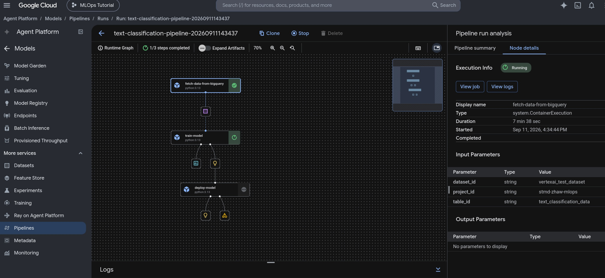

# MLOps Pipeline by Gemini Enterprise Agent Platform (formerly Vertex AI)

A beginner-friendly, step-by-step walkthrough for training and deploying a text-classification model on Google Cloud - no prior Google Cloud or Vertex AI experience required.

By the end, you'll have a small news-article classifier (World / Sports / Business / Sci/Tech) trained in the cloud and deployed behind a live prediction endpoint you can send text to.

> **Naming note:** Google rebranded Vertex AI as the **Gemini Enterprise Agent Platform** at Cloud Next 2026 (the console name changed in May 2026). This does not affect anything below: the Python package (`google-cloud-aiplatform`, imported as `google.cloud.aiplatform`) and the REST API host (`{region}-aiplatform.googleapis.com`) are unchanged, and Google has committed to keeping both working. So "Vertex AI" in commands, package names, and this doc just refers to the same underlying APIs the platform still exposes under its new name.

## Before you start: cost and cleanup

This tutorial uses real, billable Google Cloud resources. Training is a one-off cost, but the **deployed endpoint (and the tutorial VM, if you use one) keep running - and billing - until you delete them** - neither shuts itself off. **Part 6 (Clean up)** at the end of this document tells you exactly how to tear everything down. Do it once you're done experimenting.

If you're on a new Google account, Google Cloud's free trial credit is generally enough to complete this tutorial.

## Prerequisite: create and connect to a Cloud VM

Everything below could just as well run directly on your own laptop - but to avoid OS-specific dependency issues, and as a bit of extra hands-on practice, this tutorial has you create a small Google Cloud VM instead and run everything from there.

You can do everything below two ways: through the website at [console.cloud.google.com](https://console.cloud.google.com) - called **"the console"** below - or with the `gcloud` CLI installed on your own machine ([install instructions](https://cloud.google.com/sdk/docs/install)) - log in afterwards with `gcloud init` the first time, or just `gcloud auth login` after that. Steps below show the console first, with the equivalent `gcloud` command underneath where one exists.

Everything in this tutorial runs from one small Google Cloud VM that you set up once and access entirely through your browser - nothing to install on your own Windows/Mac/Linux machine, and no admin rights needed. Get this working before Part 1, so the actual project below stays about MLOps, not infrastructure.

**1. Create a Google Cloud account.** Go to [console.cloud.google.com](https://console.cloud.google.com) and sign in with a Google account. New accounts get free trial credit.

**2. Create a project.** In the console, use the project picker at the top of the page → "New Project". Or via CLI:
```bash
gcloud projects create <your-project-id> --name="MLOps Tutorial"
```
`<your-project-id>` must be globally unique - e.g. `yourname-mlops-tutorial`. You'll use this exact string as `project_id` later.

**3. Enable billing.** In the console: Billing → link a billing account to your new project. This step can only be done in the console, not via a simple CLI command, since it requires choosing/creating a billing account.

**4. Enable the Compute Engine API and create the VM.** In the console, search for "Compute Engine API" → Enable. (The first time you do this in a fresh project, it can take a minute.)

Then create the VM. Easiest via the console:
1. Go to **Compute Engine → VM instances → Create Instance**.
2. Give it a name, e.g. `mlops-tutorial-vm`.
3. Region/zone: this tutorial keeps everything in **europe-north1 (Finland)**, so set **Region** to `europe-north1` and **Zone** to `europe-north1-c`.
4. Machine type: `e2-medium` is plenty - this VM only submits jobs and runs small scripts; the actual training happens on Vertex AI's own infrastructure, not on this VM (see [How it works](#how-it-works-short-version) below).
5. Boot disk: click "Change", choose **Debian GNU/Linux 12 (bookworm)**, and set the size to **30 GB** (the default 10 GB is tight once Docker images are involved).
6. Expand "Advanced options" → "Management" → find the **"Automation" / "Startup script"** box, and paste in the contents of [`vm-startup.sh`](vm-startup.sh) from this repository.
7. Click "Create".

Or, if you'd rather run one command (e.g. from [Cloud Shell](https://console.cloud.google.com) - click the `>_` icon in the console toolbar, no install needed for this either):
```bash
gcloud services enable compute.googleapis.com
gcloud compute instances create mlops-tutorial-vm \
    --zone=europe-north1-c \
    --machine-type=e2-medium \
    --image-family=debian-12 \
    --image-project=debian-cloud \
    --boot-disk-size=30GB \
    --metadata-from-file=startup-script=vm-startup.sh
```
Run this from a checkout of this repository so the relative path to `vm-startup.sh` resolves (or point `--metadata-from-file` at wherever you saved it).

**5. Connect to your VM - two ways:**

- **A) From your browser:** in the console, go to **Compute Engine → VM instances**, find `mlops-tutorial-vm`, and click the **SSH** button next to it. This opens a full terminal in a browser tab - nothing to install locally. (Give the VM a minute or two after creation for the startup script to finish installing everything before you connect.)
- **B) From your local shell:** if you already have [`gcloud`](https://cloud.google.com/sdk/docs/install) installed on your own machine and would rather use a regular terminal than the browser tab, first point it at your project (a fresh local install doesn't know which one to use yet, unlike a browser session):
  ```bash
  gcloud config set project <your-project-id>
  gcloud compute ssh mlops-tutorial-vm --zone=europe-north1-c
  ```
  The first time you run this, `gcloud` generates an SSH key pair and pushes it to the VM for you - no manual key setup needed.

> #### Alternative: run this on your own machine instead
> If you'd rather not use a VM at all, you can run everything locally: install the [`gcloud` CLI](https://cloud.google.com/sdk/docs/install) (`gcloud init && gcloud auth login`), [Docker Desktop](https://www.docker.com/products/docker-desktop/) (includes Docker Compose), and `jq` (`apt install jq` / `brew install jq` / [jqlang.org](https://jqlang.org/download/)), then continue with Part 0 below from a local clone of this repository. Everything below works identically either way.

## Glossary

A few terms come up repeatedly below - skip this if you're already familiar with them.

| Term | What it means here |
|---|---|
| **Project** | A Google Cloud project is an isolated container for your resources, billing, and permissions - like a workspace. Everything you create below lives inside one project. |
| **Billing account** | The payment method linked to your project. Required before you can use most services, even the free tier. |
| **`gcloud` CLI** | Google Cloud's command-line tool. Almost every step below is a `gcloud` command. |
| **Compute Engine VM** | A virtual machine (a whole Linux computer) running in Google's data centers. This tutorial has you create one small VM to run all the commands below from, so it doesn't matter what OS or permissions your own laptop has. |
| **Service account** | A non-human "robot" identity that your code (running inside Docker containers here) uses to talk to Google Cloud, instead of your personal login. |
| **Service account key** | A downloadable JSON credentials file (`credential.json` here) that lets code authenticate as a service account. Treat it like a password - never commit it to git (it's already git-ignored in this repo). |
| **Enabling an API** | Google Cloud services are off by default per project. "Enabling" `bigquery.googleapis.com`, for example, turns BigQuery on for your project. |
| **Artifact Registry** | Google Cloud's Docker image registry - where the custom container image you build gets stored so Vertex AI can pull it. |
| **BigQuery** | Google Cloud's data warehouse. Used here just to simulate "fetching fresh data from a production data source," even though the dataset itself doesn't need a database. |
| **Kubeflow Pipelines (KFP) / Vertex AI Pipelines** | A way to describe a multi-step ML workflow (fetch data → train → deploy) as Python functions, compile it, and run it on managed infrastructure. |
| **Model Registry** | Vertex AI's catalog of uploaded, versioned models. |
| **Endpoint** | A deployed, running copy of a model that accepts prediction requests over HTTP. This is the part that keeps billing until deleted. |

## How it works (short version)

1. `prepare_dataset.py` loads the AG News dataset (news headlines labeled World/Sports/Business/Sci-Tech) and uploads a couple thousand rows to BigQuery, backdated with timestamps so it looks like "recent" production data.
2. A Vertex AI Pipeline (defined in `main.py`) runs three steps:
   - **Fetch**: pulls the last two days of rows from BigQuery.
   - **Train**: fine-tunes a `distilbert-base-uncased` model (Hugging Face Transformers) on the fetched text.
   - **Deploy**: uploads the trained model to the Vertex AI Model Registry and deploys it behind an Endpoint, using a custom Docker container (`serving/`) to serve predictions.
3. `sample-request.sh` sends a few example headlines to the deployed Endpoint and prints back the predicted category and probabilities.

See the [Model serving container](#model-serving-container) section near the end for details on how the custom serving container works, if you're curious.

---

## Part 0: One-time setup inside your VM

This assumes you've already created and connected to your VM (or your own machine) per the [Prerequisite](#prerequisite-create-and-connect-to-a-cloud-vm) above. Skip any step you've already done.

**0.1 One-time setup inside the VM**, right after your first connection:
```bash
sudo usermod -aG docker $USER
```
Then close this SSH tab and click "SSH" again to reconnect (group membership only applies to new sessions). From now on `docker` and `gcloud` commands work directly, without `sudo`.

**0.2 Get this repository onto the VM and authenticate `gcloud`:**
```bash
sudo apt-get update && sudo apt-get install -y git   # in case the startup script hasn't finished yet
git clone https://github.com/MLOps-ZHAW/MLOps_Labs.git
cd MLOps_Labs/VertexAI
gcloud auth login
```
`gcloud auth login` will print a URL - open it in any browser (your phone is fine), log in, and paste the resulting code back into the terminal. Everything from Part 1 onward runs from inside this `VertexAI/` directory, in this same SSH session.

---

## Part 1: Configure this project

**1.1 Point `gcloud` at your project.** Set it once as a variable here, and every later step in Part 1 reuses it:
```bash
PROJECT_ID=<your-project-id>
gcloud config set project $PROJECT_ID
```

**1.2 Enable the APIs this pipeline uses:**
```bash
gcloud services enable \
    aiplatform.googleapis.com \
    bigquery.googleapis.com \
    artifactregistry.googleapis.com \
    cloudbuild.googleapis.com
```

**1.3 Create a service account.** This is the identity the Docker containers use to call BigQuery and Vertex AI on your behalf (separate from your own personal `gcloud auth login` identity):
```bash
gcloud iam service-accounts create vertexai-tutorial \
    --display-name="VertexAI Tutorial"
```
Its full email will be `vertexai-tutorial@<your-project-id>.iam.gserviceaccount.com` - you'll need this exact string for `service_account` in `config.json`.

**1.4 Grant it the permissions it needs:**
```bash
SA="vertexai-tutorial@$PROJECT_ID.iam.gserviceaccount.com"

gcloud projects add-iam-policy-binding $PROJECT_ID --member="serviceAccount:$SA" --role="roles/aiplatform.user"
gcloud projects add-iam-policy-binding $PROJECT_ID --member="serviceAccount:$SA" --role="roles/bigquery.dataEditor"
gcloud projects add-iam-policy-binding $PROJECT_ID --member="serviceAccount:$SA" --role="roles/bigquery.jobUser"
gcloud projects add-iam-policy-binding $PROJECT_ID --member="serviceAccount:$SA" --role="roles/storage.admin"

# Let the service account act as itself - Vertex AI Pipelines needs this explicitly
# granted even though the SA submitting the job and the SA running it are the same one.
gcloud iam service-accounts add-iam-policy-binding $SA \
    --member="serviceAccount:$SA" --role="roles/iam.serviceAccountUser"
```
(These are broad roles, fine for a personal learning project. In a real production project you'd scope them down. Note `roles/storage.admin` rather than `storage.objectAdmin` - the pipeline needs to check bucket-level metadata, e.g. whether the pipeline-root bucket exists, which `objectAdmin` alone doesn't cover.)

**1.5 Download a key file for the service account** - this becomes `credential.json`, which the containers use to authenticate:
```bash
gcloud iam service-accounts keys create credential.json \
    --iam-account=vertexai-tutorial@$PROJECT_ID.iam.gserviceaccount.com
```
Run this from inside the `VertexAI/` directory so the file lands at `VertexAI/credential.json`. This file is already listed in `.gitignore` - never commit it.

**1.6 Create the Artifact Registry repository** that will hold the serving container image:
```bash
gcloud artifacts repositories create repo-vertexai \
    --repository-format=docker \
    --location=europe-north1
```
(If you use a different `region` or `repository_name` in your `config.json` below, use those values here instead.)

**1.7 Create a Cloud Storage bucket** for the pipeline's working files (Vertex AI Pipelines needs somewhere to stage inputs/outputs between steps):
```bash
BUCKET_NAME=<your-bucket-name>
gcloud storage buckets create gs://$BUCKET_NAME --location=europe-north1
```
Bucket names must be globally unique, so pick something like `$PROJECT_ID-vertexai-tutorial`.

**1.8 Create your config file:**
```bash
cp config.json.sample config.json
```
Then edit `config.json` and fill in the values you just created:

| Field | Value |
|---|---|
| `project_id` | Your project ID from Prerequisite step 2 |
| `region` | `europe-north1` (or whatever you used above - keep it consistent everywhere) |
| `bucket_name` | The bucket name from step 1.7 (without the `gs://` prefix) |
| `dataset_id` | Any name you like, e.g. `vertexai_test_dataset` - BigQuery will create it automatically when data is first written |
| `table_id` | Any name you like, e.g. `text_classification_data` |
| `service_account` | The full service account email from step 1.3 |
| `repository_name` | `repo-vertexai` (or whatever you used in step 1.6) |
| `image_name` | `text-classification-model` (or any name you like) |
| `model_tag` | `v1` |
| `model_display_name` | `text-classification-model` (or any name you like) |
| `endpoint_display_name` | `text-classification-endpoint` (or any name you like) |

`config.json` is also git-ignored - never commit it (project IDs and service account emails identify your specific cloud resources).

---

## Part 2: Load the training data into BigQuery

Build the local pipeline-runner image and use it to run the data-loading script:
```bash
docker compose build
docker compose run mlops-v1 python prepare_dataset.py
```
This downloads the AG News dataset from Hugging Face and writes ~2000 rows into the BigQuery table you configured, with randomized recent timestamps.

---

## Part 3: Build and push the model-serving container

The deployed model needs a container image that knows how to load it and answer prediction requests - this builds and pushes that image to the Artifact Registry repository from step 1.6.

```bash
cd serving
CONFIG=$(cat ../config.json | jq '.model_tag, .region, .repository_name, .image_name' | sed 's/"//g' | tr '\n' ',')
gcloud builds submit \
    --config cloudbuild.yaml \
    --substitutions _MODEL_VERSION=$(echo $CONFIG | cut -d, -f1),_LOCATION=$(echo $CONFIG | cut -d, -f2),_REPOSITORY_NAME=$(echo $CONFIG | cut -d, -f3),_IMAGE_NAME=$(echo $CONFIG | cut -d, -f4)
cd ..
```
This uses Cloud Build (a Google-managed build service) rather than building locally, so it works the same regardless of your machine's architecture. It can take a few minutes the first time.

---

## Part 4: Run the training and deployment pipeline

```bash
docker compose run mlops-v1
```
This compiles the pipeline defined in `main.py` and submits it to Vertex AI Pipelines, which then runs the fetch → train → deploy steps on managed infrastructure. Training a DistilBERT model for 5 epochs on ~2000 rows typically takes **30-60 minutes**.

You can watch progress in the console under Vertex AI (Gemini Enterprise Agent Platform) → Pipelines, in your project. Each step's logs are available by clicking into it.

Expected result - the three pipeline steps (fetch → train → deploy) running as a DAG:



---

## Part 5: Test the deployed model

```bash
chmod +x sample-request.sh
./sample-request.sh
```

Expected output looks like:
```json
{
  "predictions": [
    {
      "probabilities": {
        "Sci/Tech": 0.0032518664374947548,
        "World": 0.98935961723327637,
        "Sports": 0.0034750890918076038,
        "Business": 0.0039134090766310692
      },
      "predicted_class": "World"
    },
    {
      "probabilities": {
        "World": 0.013002258725464341,
        "Sports": 0.97295308113098145,
        "Business": 0.0041450257413089284,
        "Sci/Tech": 0.00989964697510004
      },
      "predicted_class": "Sports"
    },
    {
      "probabilities": {
        "World": 0.0058785984292626381,
        "Sports": 0.0053764986805617809,
        "Sci/Tech": 0.029164601117372509,
        "Business": 0.95958030223846436
      },
      "predicted_class": "Business"
    },
    {
      "predicted_class": "Sci/Tech",
      "probabilities": {
        "Business": 0.018011067062616348,
        "Sports": 0.002777427202090621,
        "Sci/Tech": 0.97608381509780884,
        "World": 0.003127649892121553
      }
    }
  ],
  "deployedModelId": "xxx",
  "model": "projects/xxx/locations/xxx/models/text-classification-model",
  "modelDisplayName": "text-classification-model",
  "modelVersionId": "1"
}
```

---

## Part 6: Clean up (do this when you're done)

The deployed endpoint bills for compute time as long as it exists, whether or not you're sending it requests. To tear everything down:

```bash
# 1. Undeploy the model from the endpoint, then delete the endpoint
gcloud ai endpoints list --region=europe-north1
gcloud ai endpoints undeploy-model <ENDPOINT_ID> --deployed-model-id=<DEPLOYED_MODEL_ID> --region=europe-north1
gcloud ai endpoints delete <ENDPOINT_ID> --region=europe-north1

# 2. Delete the uploaded model
gcloud ai models list --region=europe-north1
gcloud ai models delete <MODEL_ID> --region=europe-north1

# 3. If you created a tutorial VM (Prerequisite, step 4), delete it too - it bills for
#    uptime the same way the endpoint does, and isn't needed once you're done
gcloud compute instances delete mlops-tutorial-vm --zone=europe-north1-c

# 4. Optional - remove the other resources you created if you don't plan to reuse them
gcloud artifacts repositories delete repo-vertexai --location=europe-north1
gcloud storage rm -r gs://<your-bucket-name>
```
`<ENDPOINT_ID>`, `<DEPLOYED_MODEL_ID>`, and `<MODEL_ID>` come from the `list` commands above (or from the console under Vertex AI → Endpoints / Models). Since deleting the VM ends your SSH session, run steps 1-2 (and any other cleanup) *before* step 3, or just do step 3 from Cloud Shell / the console instead.

If this was a throwaway project made just for this tutorial, the simplest cleanup is deleting the whole project instead:
```bash
gcloud projects delete <your-project-id>
```

---

## Reference

### Data

- **Dataset**: AG News, a collection of news articles labeled into four categories (World, Sports, Business, Sci/Tech).
- `prepare_dataset.py` loads it via Hugging Face `datasets`, adds a randomized recent `timestamp` column (to simulate a live production feed), and writes it to BigQuery.
- The pipeline's fetch step filters BigQuery by "rows from the last two days" - purely to demonstrate a realistic "fetch fresh data" pattern. The dataset itself doesn't need BigQuery at all; it's used here for teaching purposes.

### Model

- **Architecture**: `distilbert-base-uncased` (Hugging Face Transformers), fine-tuned for 4-class text classification.
- **Training**: `AutoTokenizer` for tokenization, the `Trainer` API for training, evaluated each epoch on accuracy/precision/recall/F1.
- **Artifacts**: the fine-tuned model, tokenizer, and a `scikit-learn` `LabelEncoder` (for mapping predicted indices back to class names) are all saved together for deployment.

### Model serving container

`deploy_model` in `main.py` uploads the trained model to the Model Registry with `serving_container_image_uri` pointing at a **custom** container (rather than one of Google's prebuilt prediction containers), so it needs an image that implements the serving contract:

- `serving/main.py` is a small FastAPI app. On startup it downloads the model artifacts from the `gs://` URI the platform injects as the `AIP_STORAGE_URI` environment variable (the platform does *not* mount these files locally - the container has to fetch them itself), then loads the DistilBERT model, tokenizer, and label encoder.
- It exposes `GET /health` and `POST /predict` (matching the `serving_container_health_route`/`serving_container_predict_route` passed to `Model.upload()`), and returns predictions in the `{"predictions": [...]}` shape the platform expects.
- `serving/Dockerfile` installs a CPU-only build of PyTorch, since the model is deployed on a `n1-standard-4` (CPU) machine type in `main.py`.

### Troubleshooting

- **"Permission denied" errors**: double-check you ran the `add-iam-policy-binding` commands in step 1.4 against the exact service account email, and that `credential.json` in `config.json`'s directory matches that same service account.
- **`gcloud builds submit` fails with a repository/permission error**: make sure step 1.6 (Artifact Registry repo) succeeded, and that your own `gcloud auth login` user (not the service account) has permission to submit Cloud Builds and push images - if you're the project Owner, you already do.
- **Pipeline stuck/failed in the console**: click into the failing step to see its logs; most first-run failures are a missing API (Part 1.2), a missing IAM role (Part 1.4), or a bucket/dataset name typo in `config.json`.
- **`git`, `docker`, `jq`, or `gcloud` missing on the tutorial VM**: the startup script (Prerequisite, step 4) either hadn't finished yet when you connected (wait a minute after creating the VM, or check with `sudo journalctl -u google-startup-scripts.service`), or wasn't attached to the VM at all (double-check you pasted `vm-startup.sh`'s contents into the startup-script field, or used `--metadata-from-file` in the `gcloud` command). Either way, you can always install the missing piece by hand, e.g. `sudo apt-get update && sudo apt-get install -y git jq docker.io google-cloud-cli`.
