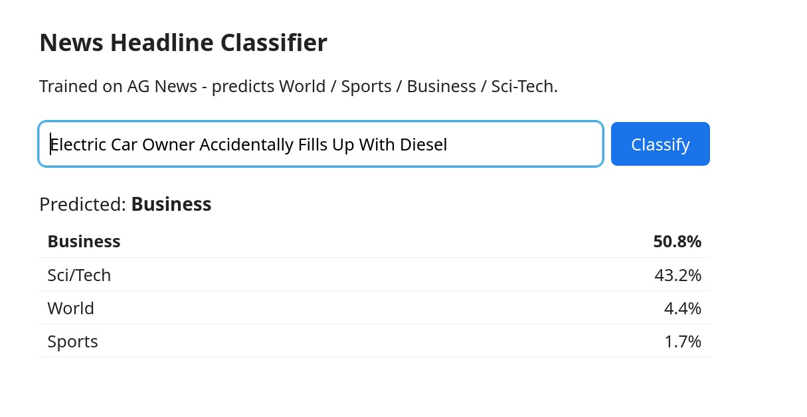

# MLOps Pipeline by Gemini Enterprise Agent Platform (formerly Vertex AI)

A beginner-friendly, step-by-step walkthrough for training and deploying a text-classification model on Google Cloud - no prior Google Cloud or Vertex AI experience required.

By the end, you'll have a small news-article classifier (World / Sports / Business / Sci/Tech) trained in the cloud and deployed behind a live prediction endpoint you can send text to - plus, optionally, a simple web GUI hosted on Cloud Run where you can type in a headline and see it classified in the browser.

> **Naming note:** Google rebranded Vertex AI as the **Gemini Enterprise Agent Platform** at Cloud Next 2026 (the console name changed in May 2026). This does not affect anything below: the Python package (`google-cloud-aiplatform`, imported as `google.cloud.aiplatform`) and the REST API host (`{region}-aiplatform.googleapis.com`) are unchanged, and Google has committed to keeping both working. So "Vertex AI" in commands, package names, and this doc just refers to the same underlying APIs the platform still exposes under its new name.

## Before you start: cost and cleanup

This tutorial uses real, billable Google Cloud resources. Training is a one-off cost, but the **deployed endpoint (and the tutorial VM, if you use one) keep running - and billing - until you delete them** - neither shuts itself off. **Part 7 (Clean up)** at the end of this document tells you exactly how to tear everything down. Do it once you're done experimenting.

If you're on a new Google account, Google Cloud's free trial credit is generally enough to complete this tutorial.

## Glossary

A few terms come up repeatedly below - skip this if you're already familiar with them.

| Term | What it means here |
|---|---|
| **Project** | A Google Cloud project is an isolated container for your resources, billing, and permissions - like a workspace. Everything you create below lives inside one project. |
| **Billing account** | The payment method linked to your project. Required before you can use most services, even the free tier. |
| **`gcloud` CLI** | Google Cloud's command-line tool. Almost every step below is a `gcloud` command. |
| **Compute Engine VM** | A virtual machine (a whole Linux computer) running in Google's data centers. This tutorial has you create one small VM to run all the commands below from, so it doesn't matter what OS or permissions your own laptop has. |
| **Service account** | A non-human "robot" identity that your code (running inside Docker containers here) uses to talk to Google Cloud, instead of your personal login. |
| **Service account key** | A downloadable JSON credentials file (`credential.json` here) that lets code authenticate as a service account. Treat it like a password - never commit it to git (it's already git-ignored in this repo). |
| **Enabling an API** | Google Cloud services are off by default per project. "Enabling" `bigquery.googleapis.com`, for example, turns BigQuery on for your project. |
| **Artifact Registry** | Google Cloud's Docker image registry - where the custom container image you build gets stored so Vertex AI can pull it. |
| **BigQuery** | Google Cloud's data warehouse. Used here just to simulate "fetching fresh data from a production data source," even though the dataset itself doesn't need a database. |
| **Kubeflow Pipelines (KFP) / Vertex AI Pipelines** | A way to describe a multi-step ML workflow (fetch data → train → deploy) as Python functions, compile it, and run it on managed infrastructure. |
| **Model Registry** | Vertex AI's catalog of uploaded, versioned models. |
| **Endpoint** | A deployed, running copy of a model that accepts prediction requests over HTTP. This is the part that keeps billing until deleted. |

## Prerequisite: create and connect to a Cloud VM

Everything below could just as well run directly on your own laptop - but to avoid OS-specific dependency issues, and as a bit of extra hands-on practice, this tutorial has you create a small Google Cloud VM instead, set up once and accessed entirely through your browser, and runs everything from there. (If you'd rather skip the VM, see the alternative at the end of this section.) Get this working before Part 1, so the actual project stays about MLOps, not infrastructure.

You can do the steps below three ways: through the website at [console.cloud.google.com](https://console.cloud.google.com) - called **"the console"** below - through **Cloud Shell** (a terminal built into the console with `gcloud` pre-installed and pre-authenticated - click the `>_` icon in the console toolbar, nothing to set up), or with the `gcloud` CLI installed on your own machine (optional - see step 3). Each step below shows the console first, with the equivalent `gcloud` command underneath where one exists; run that command in Cloud Shell or in your own terminal, whichever you set up.

**1. Create a Google Cloud account.** Go to [console.cloud.google.com](https://console.cloud.google.com) and sign in with a Google account. New accounts get free trial credit.

**2. Create a project.** In the console, use the project picker at the top of the page → "New Project". Or via CLI (from Cloud Shell, or your own terminal once you've done step 3 below):
```bash
gcloud projects create <your-project-id> --name="MLOps Tutorial"
```
`<your-project-id>` must be globally unique - e.g. `yourname-mlops-tutorial`. You'll use this exact string as `project_id` later.

**3. (Optional) Install and connect the `gcloud` CLI on your own machine.** Skip this if the console or Cloud Shell alone is enough for you - it only matters if you'd rather run commands (including connecting to your VM in step 6 below) from a regular terminal on your own machine instead of the browser.

1. Install it: follow the [official instructions](https://cloud.google.com/sdk/docs/install) for your OS.
2. Run `gcloud init`. This is a one-time setup per machine: it opens a browser so you can log into your Google account, then offers to set the project you just created in step 2 as your default.
3. If you skipped picking a project during `gcloud init` (or just want to be sure), set it explicitly:
   ```bash
   gcloud config set project <your-project-id>
   ```
4. Double-check it's pointed at the right project and account:
   ```bash
   gcloud config list
   ```

From here on, any `gcloud` command shown below works the same whether you run it in Cloud Shell or in your own terminal.

**4. Enable billing.** In the console: Billing → link a billing account to your new project. This step can only be done in the console, not via a simple CLI command, since it requires choosing/creating a billing account.

**5. Enable the Compute Engine API and create the VM.** In the console, search for "Compute Engine API" → Enable. (The first time you do this in a fresh project, it can take a minute.)

Then create the VM. Easiest via the console:
1. Go to **Compute Engine → VM instances → Create Instance**.
2. Give it a name, e.g. `mlops-tutorial-vm`.
3. Region/zone: this tutorial keeps everything in **europe-west1 (Belgium)**, so set **Region** to `europe-west1` and **Zone** to `europe-west1-b`.
4. Machine type: `e2-medium` is plenty - this VM only submits jobs and runs small scripts; the actual training happens on Vertex AI's own infrastructure, not on this VM (see [How it works](#how-it-works-short-version) below).
5. Boot disk: click "Change", choose **Debian GNU/Linux 12 (bookworm)**, and set the size to **30 GB** (the default 10 GB is tight once Docker images are involved).
6. Expand "Advanced options" → "Management" → find the **"Automation" / "Startup script"** box, and paste in the contents of [`vm-startup.sh`](vm-startup.sh) from this repository.
7. Click "Create".

Or, if you'd rather run one command (from Cloud Shell, or your own terminal if you completed step 3 above):
```bash
gcloud services enable compute.googleapis.com
gcloud compute instances create mlops-tutorial-vm \
    --zone=europe-west1-b \
    --machine-type=e2-medium \
    --image-family=debian-12 \
    --image-project=debian-cloud \
    --boot-disk-size=30GB \
    --metadata-from-file=startup-script=vm-startup.sh
```
Run this from a checkout of this repository so the relative path to `vm-startup.sh` resolves (or point `--metadata-from-file` at wherever you saved it).

**6. Connect to your VM - two ways:**

- **A) From your browser:** in the console, go to **Compute Engine → VM instances**, find `mlops-tutorial-vm`, and click the **SSH** button next to it. This opens a full terminal in a browser tab - nothing to install locally. (Give the VM a minute or two after creation for the startup script to finish installing everything before you connect.)
- **B) From your local shell:** if you completed step 3 above, `gcloud` is already installed and pointed at your project, so just run:
  ```bash
  gcloud compute ssh mlops-tutorial-vm --zone=europe-west1-b
  ```
  The first time you run this, `gcloud` generates an SSH key pair and pushes it to the VM for you - no manual key setup needed.

> #### Alternative: run this on your own machine instead
> If you'd rather not use a VM at all, you can run everything locally: install `gcloud` per step 3 above (if you haven't already), plus [Docker Desktop](https://www.docker.com/products/docker-desktop/) (includes Docker Compose) and `jq` (`apt install jq` / `brew install jq` / [jqlang.org](https://jqlang.org/download/)), then continue with Part 0 below from a local clone of this repository. Everything below works identically either way.

## How it works (quick summary)

1. `prepare_dataset.py` loads the AG News dataset (news headlines labeled World/Sports/Business/Sci-Tech) and uploads a couple thousand rows to BigQuery, backdated with timestamps so it looks like "recent" production data.
2. A Vertex AI Pipeline (defined in `main.py`) runs three steps:
   - **Fetch**: pulls the last two days of rows from BigQuery.
   - **Train**: fine-tunes a `distilbert-base-uncased` model (Hugging Face Transformers) on the fetched text.
   - **Deploy**: uploads the trained model to the Vertex AI Model Registry and deploys it behind an Endpoint, using a custom Docker container (`serving/`) to serve predictions.
3. `sample-request.sh` sends a few example headlines to the deployed Endpoint and prints back the predicted category and probabilities.

See the [Model serving container](#model-serving-container) section near the end for details on how the custom serving container works, if you're curious.

---

## Part 0: One-time setup inside your VM

This assumes you've already created and connected to your VM (or your own machine) per the [Prerequisite](#prerequisite-create-and-connect-to-a-cloud-vm) above. Skip any step you've already done.

**0.1 One-time setup inside the VM**, right after your first connection:
```bash
sudo usermod -aG docker $USER
```
Then close this SSH tab and click "SSH" again to reconnect (group membership only applies to new sessions). From now on `docker` and `gcloud` commands work directly, without `sudo`.

**0.2 Get this repository onto the VM and authenticate `gcloud`:**
```bash
sudo apt-get update && sudo apt-get install -y git   # in case the startup script hasn't finished yet
git clone https://github.com/MLOps-ZHAW/MLOps_Labs.git
cd MLOps_Labs/VertexAI
gcloud auth login
```
`gcloud auth login` will print a URL - open it in any browser (your phone is fine), log in, and paste the resulting code back into the terminal. Everything from Part 1 onward runs from inside this `VertexAI/` directory, in this same SSH session.

---

## Part 1: Configure this project

**1.1 Point `gcloud` at your project.** Set it once as a variable here, and every later step in Part 1 reuses it:
```bash
PROJECT_ID=<your-project-id>
gcloud config set project $PROJECT_ID
```

**1.2 Enable the APIs this pipeline uses:**
```bash
gcloud services enable \
    aiplatform.googleapis.com \
    bigquery.googleapis.com \
    artifactregistry.googleapis.com \
    cloudbuild.googleapis.com \
    cloudresourcemanager.googleapis.com
```
(`cloudresourcemanager.googleapis.com` isn't called directly by this tutorial's code, but the Vertex AI SDK uses it internally to verify your `pipeline_root` bucket actually belongs to your project before writing to it - without it enabled, Part 4 prints a scary but non-fatal "bucket squatting attack" traceback; see Troubleshooting.)

**1.3 Create a service account.** This is the identity the Docker containers use to call BigQuery and Vertex AI on your behalf (separate from your own personal `gcloud auth login` identity):
```bash
gcloud iam service-accounts create vertexai-tutorial \
    --display-name="VertexAI Tutorial"
```
Its full email will be `vertexai-tutorial@<your-project-id>.iam.gserviceaccount.com` - you'll need this exact string for `service_account` in `config.json`.

**1.4 Grant it the permissions it needs:**
```bash
SA="vertexai-tutorial@$PROJECT_ID.iam.gserviceaccount.com"

gcloud projects add-iam-policy-binding $PROJECT_ID --member="serviceAccount:$SA" --role="roles/aiplatform.user"
gcloud projects add-iam-policy-binding $PROJECT_ID --member="serviceAccount:$SA" --role="roles/bigquery.dataEditor"
gcloud projects add-iam-policy-binding $PROJECT_ID --member="serviceAccount:$SA" --role="roles/bigquery.jobUser"
gcloud projects add-iam-policy-binding $PROJECT_ID --member="serviceAccount:$SA" --role="roles/storage.admin"

# Lets the Vertex AI SDK resolve your project's number (via Cloud Resource Manager) to verify
# the pipeline_root bucket really belongs to this project - without it, Part 4 raises a
# non-fatal but scary "bucket squatting attack" error even when the bucket is fine.
gcloud projects add-iam-policy-binding $PROJECT_ID --member="serviceAccount:$SA" --role="roles/browser"

# Let the service account act as itself - Vertex AI Pipelines needs this explicitly
# granted even though the SA submitting the job and the SA running it are the same one.
gcloud iam service-accounts add-iam-policy-binding $SA \
    --member="serviceAccount:$SA" --role="roles/iam.serviceAccountUser"
```
(These are broad roles, fine for a personal learning project. In a real production project you'd scope them down. Note `roles/storage.admin` rather than `storage.objectAdmin` - the pipeline needs to check bucket-level metadata, e.g. whether the pipeline-root bucket exists, which `objectAdmin` alone doesn't cover.)

**1.5 Download a key file for the service account** - this becomes `credential.json`, which the containers use to authenticate:
```bash
gcloud iam service-accounts keys create credential.json \
    --iam-account=vertexai-tutorial@$PROJECT_ID.iam.gserviceaccount.com
```
Run this from inside the `VertexAI/` directory so the file lands at `VertexAI/credential.json`. This file is already listed in `.gitignore` - never commit it.

**1.6 Create the Artifact Registry repository** that will hold the serving container image:
```bash
gcloud artifacts repositories create repo-vertexai \
    --repository-format=docker \
    --location=europe-west1
```
(If you use a different `region` or `repository_name` in your `config.json` below, use those values here instead.)

**1.7 Create a Cloud Storage bucket** for the pipeline's working files (Vertex AI Pipelines needs somewhere to stage inputs/outputs between steps):
```bash
BUCKET_NAME=<your-bucket-name>
gcloud storage buckets create gs://$BUCKET_NAME --location=europe-west1
```
Bucket names must be globally unique, so pick something like `$PROJECT_ID-vertexai-tutorial`.

**1.8 Create your config file:**
```bash
cp config.json.sample config.json
```
Then edit `config.json` and fill in the values you just created:

| Field | Value |
|---|---|
| `project_id` | Your project ID from Prerequisite step 2 |
| `region` | `europe-west1` (or whatever you used above - keep it consistent everywhere) |
| `bucket_name` | The bucket name from step 1.7 (without the `gs://` prefix) |
| `dataset_id` | Any name you like, e.g. `vertexai_test_dataset` - BigQuery will create it automatically when data is first written |
| `table_id` | Any name you like, e.g. `text_classification_data` |
| `service_account` | The full service account email from step 1.3 |
| `repository_name` | `repo-vertexai` (or whatever you used in step 1.6) |
| `image_name` | `text-classification-model` (or any name you like) |
| `model_tag` | `v1` |
| `model_display_name` | `text-classification-model` (or any name you like) |
| `endpoint_display_name` | `text-classification-endpoint` (or any name you like) |

`config.json` is also git-ignored - never commit it (project IDs and service account emails identify your specific cloud resources).

---

## Part 2: Load the training data into BigQuery

Build the local pipeline-runner image and use it to run the data-loading script:
```bash
docker compose build
docker compose run mlops-v1 python prepare_dataset.py
```
This downloads the AG News dataset from Hugging Face and writes ~2000 rows into the BigQuery table you configured, with randomized recent timestamps.

---

## Part 3: Build and push the model-serving container

The deployed model needs a container image that knows how to load it and answer prediction requests - this builds and pushes that image to the Artifact Registry repository from step 1.6.

```bash
cd serving
gcloud builds submit \
    --config cloudbuild.yaml \
    --substitutions _MODEL_VERSION=$(jq -r '.model_tag' ../config.json),_LOCATION=$(jq -r '.region' ../config.json),_REPOSITORY_NAME=$(jq -r '.repository_name' ../config.json),_IMAGE_NAME=$(jq -r '.image_name' ../config.json)
cd ..
```
(Each `$(jq -r '.field' ../config.json)` just reads one value out of your config file to fill in the build substitution of the same name.)
This uses Cloud Build (a Google-managed build service) rather than building locally, so it works the same regardless of your machine's architecture. It can take a few minutes the first time.

---

## Part 4: Run the training and deployment pipeline

```bash
docker compose run mlops-v1
```
This compiles the pipeline defined in `main.py` and submits it to Vertex AI Pipelines, which then runs the fetch → train → deploy steps on managed infrastructure, blocking until the whole thing finishes. Budget **around 70-90 minutes end to end**. Measured from an actual run:

| Step | Typical duration | What it's mostly spending time on |
|---|---|---|
| `fetch-data-from-bigquery` | ~5-6 min | Mostly cold-start (Vertex AI spins up a fresh container for each step) plus a quick BigQuery query |
| `train-model` | ~40-50 min | Fine-tuning DistilBERT for 5 epochs on ~2000 rows on CPU (no GPU/accelerator is configured) |
| `deploy-model` | ~20-25 min | Uploading to Model Registry, then provisioning and deploying an Endpoint on an `n1-standard-4` VM (image pull + serving container startup dominate) |
| **Total** | **~70-90 min** | |

These steps run sequentially, not in parallel, so the total is roughly their sum. Actual times vary by run - use this as a rough guide for how long to expect `docker compose run` to keep you waiting, not a guarantee.

**If your SSH session drops during this wait, don't panic and don't re-run the command.** The pipeline itself runs on Vertex AI's managed infrastructure regardless of whether anything on your VM is still connected - closing your laptop or losing Wi-Fi doesn't stop it. Even the `docker compose run` process that submitted it keeps running in the background on the VM, independent of your SSH session, since Docker containers live in the Docker daemon rather than in your terminal. Reconnect (Prerequisite, step 6) and check on it:
```bash
docker ps
```
Find the container still `Up` and running `python main.py`, then re-attach to its output:
```bash
docker logs -f <container-name>
```
(Ctrl+C here just stops watching the logs - it doesn't stop the pipeline.) Or just check progress in the console, as below.

You can watch progress in the console under Vertex AI (Gemini Enterprise Agent Platform) → Pipelines, in your project. Each step's logs are available by clicking into it.

Expected result - the three pipeline steps (fetch → train → deploy) running as a DAG:


---

## Part 5: Test the deployed model

```bash
chmod +x sample-request.sh
./sample-request.sh
```

`sample-request.sh` sends a few hardcoded example headlines to your deployed Endpoint and prints back what the model predicts for each. Specifically, it:

1. Reads `project_id`, `region`, and `endpoint_display_name` out of `config.json` with `jq`.
2. Gets a short-lived access token via `gcloud auth print-access-token` - note this uses *your own* logged-in `gcloud auth login` identity, not the `vertexai-tutorial` service account (`credential.json`) used everywhere else in this tutorial. It works as long as your own account has permission to call the endpoint, which it does if you're the project Owner.
3. Sends a `POST` request straight to Vertex AI's REST API - `https://{region}-aiplatform.googleapis.com/v1/projects/{project_id}/locations/{region}/endpoints/{endpoint_display_name}:predict` - with a JSON body containing 4 sample news headlines as `instances`. (Note this URL uses `endpoint_display_name`, not the endpoint's numeric ID - Vertex AI's `predict` REST method accepts either.) The request body matches the `{"instances": [...]}` shape your custom serving container's `/predict` route expects - see [Model serving container](#model-serving-container).
4. Prints each headline next to what the model predicted for it: the predicted category, plus every class's probability as a percentage, sorted highest first.

The comment at the top of the script's `headlines` array lists the true labels (World, Sports, Business, Sci/Tech) in the same order as the 4 headlines, so you can eyeball whether the predictions actually match.

Expected output looks like:
```
Project ID: your-project-id
Location: europe-west1
Endpoint Name: text-classification-endpoint

Headline: Arrested Qaida terrorist an India-born WASHINGTON: Abu Musa al-Hindi, one of the principle terror suspects charged with plotting to attack US financial institutions, has been identified as India-born Dhiren Barot. British police on Tuesday charged Barot, 32, of gathering surveillance plans of ...
  -> World
     World: 98%
     Business: 1%
     Sci/Tech: 1%
     Sports: 0%

Headline: DiMarco, Riley Get on Ryder Cup Team (AP) AP - Hal Sutton had a good idea what kind of U.S. team he would take to the Ryder Cup. All that changed in the final round of the PGA Championship.
  -> Sports
     Sports: 98%
     World: 1%
     Business: 0%
     Sci/Tech: 0%

Headline: Art Looks Like Fine Investment for Funds (Reuters) Reuters - Some mutual funds invest in stocks;\others invest in bonds. Now a new breed of funds is offering\the chance to own fine art.
  -> Business
     Business: 97%
     Sci/Tech: 1%
     World: 1%
     Sports: 1%

Headline:  One in 12 Emails Infected with Virus; The number of attempted attacks by computer viruses rocketed in the first half of the year, according to a report published today. 
  -> Sci/Tech
     Sci/Tech: 97%
     Business: 2%
     World: 0%
     Sports: 0%
```

**Want to try your own headlines instead of the 4 built-in ones?** Pass `--interactive`: same script, same `:predict` call, but it prompts you for a headline instead of using the hardcoded list, and loops so you can keep trying more:
```bash
./sample-request.sh --interactive
```
```
Type a news headline and press Enter to classify it (World / Sports / Business / Sci-Tech).
Type 'quit' or press Ctrl+C to stop.

> Local team wins championship after dramatic overtime victory
  -> Sports
     Sports: 97%
     World: 2%
     Business: 1%
     Sci/Tech: 1%

> Central bank raises interest rates to combat inflation
  -> Business
     Business: 90%
     World: 8%
     Sci/Tech: 1%
     Sports: 1%

> quit
```

Try headlines that straddle two categories (e.g. a sports team's stock price, or a tech company's court case) to get a feel for where the model is confident versus genuinely unsure.

---

## Part 6: (Optional) Deploy a web GUI with Cloud Run

As a next step beyond the command-line scripts, [`webapp/`](webapp) in this repo is a small [FastAPI](https://fastapi.tiangolo.com/) app - one page, one text box - that calls your deployed Endpoint the same way `sample-request.sh` does, and shows the result in a browser instead of a terminal. **Cloud Run** is the natural way to host something this small on Google Cloud: it builds and deploys a container from source in one command, gives you a public HTTPS URL, and scales to zero (costs nothing) when nobody's using it.

**How it authenticates:** unlike the shell scripts (which use *your own* `gcloud auth login` identity) or the pipeline (which uses the `credential.json` key file), the webapp picks up credentials automatically from whichever service account Cloud Run attaches to it - no key file involved. The `--service-account` flag below reuses the `vertexai-tutorial` service account, which already has `roles/aiplatform.user` from step 1.4, so no new IAM setup is needed. See [`webapp/main.py`](webapp/main.py) for the whole thing - it's under 100 lines.

**6.1 Enable Cloud Run** (only needed once per project):
```bash
gcloud services enable run.googleapis.com
```

**6.2 Deploy it** - this builds the container via Cloud Build and deploys it, in one command:
```bash
gcloud run deploy headline-classifier \
    --source=webapp/ \
    --region=$(jq -r '.region' config.json) \
    --service-account=$(jq -r '.service_account' config.json) \
    --set-env-vars=PROJECT_ID=$(jq -r '.project_id' config.json),REGION=$(jq -r '.region' config.json),ENDPOINT_DISPLAY_NAME=$(jq -r '.endpoint_display_name' config.json)
```
The first run also creates a small Artifact Registry repo called `cloud-run-source-deploy` to hold the built image (separate from `repo-vertexai` from step 1.6) - that's expected.

By default, the deployed service **requires authentication**: nobody can call it without a valid Google identity token, so your endpoint isn't left open to the internet just because you deployed a GUI for it. Test it like this (works from the VM, Cloud Shell, or your own terminal - anywhere logged into `gcloud` as a user with access to the project):
```bash
SERVICE_URL=$(gcloud run services describe headline-classifier --region=$(jq -r '.region' config.json) --format='value(status.url)')
curl -H "Authorization: Bearer $(gcloud auth print-identity-token)" "$SERVICE_URL"
```

**6.3 (Optional) Make it public**, if you'd like to just open it in a browser without dealing with tokens:
```bash
gcloud run services add-iam-policy-binding headline-classifier \
    --region=$(jq -r '.region' config.json) \
    --member="allUsers" \
    --role="roles/run.invoker"
```
Then open `$SERVICE_URL` directly in any browser. Be aware this makes the page - and, by extension, the ability to call your Vertex AI Endpoint through it - reachable by anyone with the link, not just you. Only do this for a short-lived demo, and make sure to tear it down afterward (Part 7 below).

Expected result:



---

## Part 7: Clean up (do this when you're done)

The deployed endpoint bills for compute time as long as it exists, whether or not you're sending it requests. To tear everything down:

```bash
# 1. Undeploy the model from the endpoint, then delete the endpoint
gcloud ai endpoints list --region=europe-west1
gcloud ai endpoints undeploy-model <ENDPOINT_ID> --deployed-model-id=<DEPLOYED_MODEL_ID> --region=europe-west1
gcloud ai endpoints delete <ENDPOINT_ID> --region=europe-west1

# 2. Delete the uploaded model
gcloud ai models list --region=europe-west1
gcloud ai models delete <MODEL_ID> --region=europe-west1

# 3. If you deployed the Part 6 web GUI, delete it too - Cloud Run bills for the time
#    requests are being handled, and if you made it public (step 6.3), also revoke that
gcloud run services delete headline-classifier --region=europe-west1

# 4. If you created a tutorial VM (Prerequisite, step 5), delete it too - it bills for
#    uptime the same way the endpoint does, and isn't needed once you're done
gcloud compute instances delete mlops-tutorial-vm --zone=europe-west1-b

# 5. Optional - remove the other resources you created if you don't plan to reuse them
gcloud artifacts repositories delete repo-vertexai --location=europe-west1
gcloud artifacts repositories delete cloud-run-source-deploy --location=europe-west1  # only if you did Part 6
gcloud storage rm -r gs://<your-bucket-name>
```
`<ENDPOINT_ID>`, `<DEPLOYED_MODEL_ID>`, and `<MODEL_ID>` come from the `list` commands above (or from the console under Vertex AI → Endpoints / Models). Since deleting the VM ends your SSH session, run steps 1-3 (and any other cleanup) *before* step 4, or just do step 4 from Cloud Shell / the console instead.

If this was a throwaway project made just for this tutorial, the simplest cleanup is deleting the whole project instead:
```bash
gcloud projects delete <your-project-id>
```

---

## Reference

### Data

- **Dataset**: AG News, a collection of news articles labeled into four categories (World, Sports, Business, Sci/Tech).
- `prepare_dataset.py` loads it via Hugging Face `datasets`, adds a randomized recent `timestamp` column (to simulate a live production feed), and writes it to BigQuery.
- The pipeline's fetch step filters BigQuery by "rows from the last two days" - purely to demonstrate a realistic "fetch fresh data" pattern. The dataset itself doesn't need BigQuery at all; it's used here for teaching purposes.

### Model

- **Architecture**: `distilbert-base-uncased` (Hugging Face Transformers), fine-tuned for 4-class text classification.
- **Training**: `AutoTokenizer` for tokenization, the `Trainer` API for training, evaluated each epoch on accuracy/precision/recall/F1.
- **Artifacts**: the fine-tuned model, tokenizer, and a `scikit-learn` `LabelEncoder` (for mapping predicted indices back to class names) are all saved together for deployment.

### Model serving container

`deploy_model` in `main.py` uploads the trained model to the Model Registry with `serving_container_image_uri` pointing at a **custom** container (rather than one of Google's prebuilt prediction containers), so it needs an image that implements the serving contract:

- `serving/main.py` is a small FastAPI app. On startup it downloads the model artifacts from the `gs://` URI the platform injects as the `AIP_STORAGE_URI` environment variable (the platform does *not* mount these files locally - the container has to fetch them itself), then loads the DistilBERT model, tokenizer, and label encoder.
- It exposes `GET /health` and `POST /predict` (matching the `serving_container_health_route`/`serving_container_predict_route` passed to `Model.upload()`), and returns predictions in the `{"predictions": [...]}` shape the platform expects.
- `serving/Dockerfile` installs a CPU-only build of PyTorch, since the model is deployed on a `n1-standard-4` (CPU) machine type in `main.py`.

### Troubleshooting

- **"Permission denied" errors**: double-check you ran the `add-iam-policy-binding` commands in step 1.4 against the exact service account email, and that `credential.json` in `config.json`'s directory matches that same service account.
- **`gcloud builds submit` fails with a repository/permission error**: make sure step 1.6 (Artifact Registry repo) succeeded, and that your own `gcloud auth login` user (not the service account) has permission to submit Cloud Builds and push images - if you're the project Owner, you already do.
- **Pipeline stuck/failed in the console**: click into the failing step to see its logs; most first-run failures are a missing API (Part 1.2), a missing IAM role (Part 1.4), or a bucket/dataset name typo in `config.json`.
- **`git`, `docker`, `jq`, or `gcloud` missing on the tutorial VM**: the startup script (Prerequisite, step 5) either hadn't finished yet when you connected (wait a minute after creating the VM, or check with `sudo journalctl -u google-startup-scripts.service`), or wasn't attached to the VM at all (double-check you pasted `vm-startup.sh`'s contents into the startup-script field, or used `--metadata-from-file` in the `gcloud` command). Either way, you can always install the missing piece by hand, e.g. `sudo apt-get update && sudo apt-get install -y git jq docker.io google-cloud-cli`.
- **Part 4 prints `ValueError: Output artifacts bucket "..." exists but does not belong to project "..."` / "This may indicate a bucket squatting attack"**: this is usually a false alarm, and the pipeline run itself still succeeds (it appears right before `PipelineJob created`) - it does **not** mean your bucket is compromised. It's the Vertex AI SDK failing to verify bucket ownership because either `cloudresourcemanager.googleapis.com` isn't enabled (step 1.2) or the service account is missing `roles/browser` (step 1.4) - both needed for the SDK to resolve your project ID to a project number. Add whichever is missing and rerun; if you just want to confirm the bucket is genuinely yours, check with `gcloud storage buckets describe gs://<bucket_name> --format="value(name)"` (a 403 there means someone else really does own the name - pick a more unique `bucket_name`, e.g. `$PROJECT_ID-vertexai-tutorial`).
- **Lost my SSH connection during Part 4's ~70-90 minute wait - is the pipeline dead?**: no - see the note in Part 4. The pipeline runs on Vertex AI's infrastructure independent of your VM, and the `docker compose run` process that submitted it keeps running on the VM regardless of your SSH session. Reconnect and run `docker ps` to find it still `Up`, then `docker logs -f <container-name>` to watch it again.
- **`gcloud compute instances create` fails with "No default subnetwork was found in the region of the instance"**: your project's `default` VPC network exists but is missing an auto-created subnet in the region you're using (some projects' default networks never backfill newer regions). Check with:
  ```bash
  gcloud compute networks subnets list --filter="region:europe-west1"
  ```
  If it comes back empty, create the missing subnet - pick a `/20` range that doesn't overlap any range shown by `gcloud compute networks subnets list` (no filter) - then retry the VM creation command:
  ```bash
  gcloud compute networks subnets create default \
      --network=default \
      --region=europe-west1 \
      --range=<UNUSED_RANGE>/20
  ```
