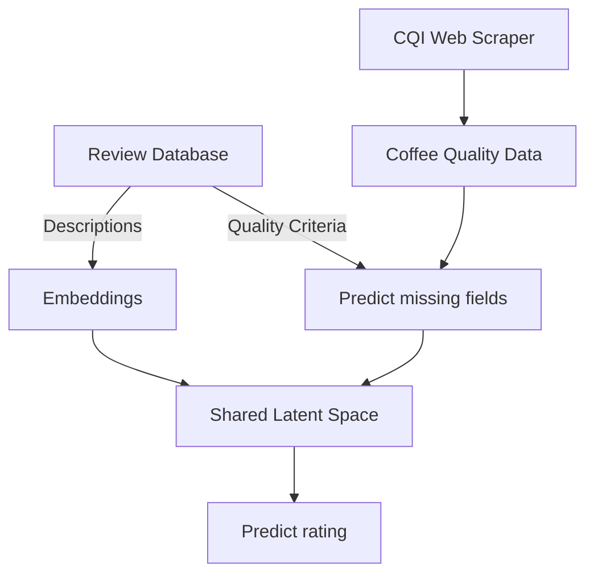

# Data processing: from notebooks to pipelines to batch processing

Everybody loves notebooks, and by now, they can do just about everything: run code, show plots, [build website, publish packages](https://nbdev.fast.ai/) - you name it.
Yet, there comes the time, when your project outgrows the notebook stage, when small-scale, interactive experiments have to be converted into automated, production-ready pipelines.

This lab is also a latent segue into a broader topic: data-centric MLOps. So far, we have almost exclusively been focussing on the machine learning _models_.
However, as you certainly know, machine learning only works with good, high quality data. This week, we start our exploration into the data-side of machine learning
by looking at how you can build and scale data processing pipelines - from notebooks to clusters.

## What you will learn

- The basics of `Kedro`, a framework for building data and ML pipelines.
- The basics of `Airflow`, a scheduler and batch processing platform.
- How to use the two to convert a notebook into a batch processing pipeline.

In this lab, you will learn about one way of converting a notebook-based experiment into a scalable pipeline.
We will start with a good old Jupyter Notebook. Then, you will be introduced to [Kedro](https://kedro.org/), a framework for building modular, maintainable pipelines from plain Python functions. Once we have created a Kedro pipeline, we will deploy it using [Airflow](https://airflow.apache.org/), a popular open-source workload scheduler.

## Setup

Everything in this lab runs on a laptop: the whole coffee pipeline takes well under a minute on a 4-core CPU and needs less than 2 GB of RAM (the first run downloads a small embedding model from Hugging Face, so you need an internet connection). If you prefer, you can also use the lab VM - a GPU is used automatically if available, but it is not needed.

```shell
conda env create -f lab05/env.yaml
conda activate mlops-lab-05
```

- **Windows:** Airflow does not run natively on Windows. Use [WSL](https://learn.microsoft.com/en-us/windows/wsl/install) and create the environment inside WSL, or work on the lab VM.
- **Remote VM:** the Airflow UI (port 8080) and Kedro-Viz (port 4141) run on the VM. Forward the ports to your laptop, e.g. `ssh -L 8080:localhost:8080 -L 4141:localhost:4141 <user>@<host>`.
- Kedro collects anonymous usage statistics. You can opt out with `export KEDRO_DISABLE_TELEMETRY=true`.

## Required reading

To get you up to speed with Kedro and Airflow we provide you with a short introduction to each of them.

| Required Reading |Link|
|:------------------|:---|
| Kedro 101 | [Click me](./kedro/kedro_101.md) |
| Airflow 101  | [Click me](./airflow/airflow_101.md) |

## A multi-modal coffee pipeline

Now that you are an expert pipeline builder, you deserve a treat. What better than a cup of the superior caffeinated hot beverage - coffee! Life is too short for bad coffee. So, we want to find the best one.

There are a few quality criteria that one can evaluate:

- Aroma: Refers to the scent or fragrance of the coffee.
- Flavor: The flavor of coffee is evaluated based on the taste, including any sweetness, bitterness, acidity, and other flavor notes.
- Aftertaste: Refers to the lingering taste that remains in the mouth after swallowing the coffee.
- Acidity: Acidity in coffee refers to the brightness or liveliness of the taste.
- Body: The body of coffee refers to the thickness or viscosity of the coffee in the mouth.
- Balance: Balance refers to how well the different flavor components of the coffee work together.
- Uniformity: Uniformity refers to the consistency of the coffee from cup to cup.
- Clean Cup: A clean cup refers to a coffee that is free of any off-flavors or defects, such as sourness, mustiness, or staleness.
- Sweetness: It can be described as caramel-like, fruity, or floral, and is a desirable quality in coffee.

The Coffee Quality Institute (CQI) maintains a database of coffee quality profiles and [_somebody_](https://github.com/fatih-boyar/coffee-quality-data-CQI/tree/main) already wrote a web scraper for this data.

Your coffee-addicted (but only modestly data-science-skilled) friend also stumbled upon a database of coffee reviews, that include 5 of the 9 coffee quality criteria, along with text descriptions of the coffee. They even prepared the following pipeline, for which you can find a notebook in [`coffee_analytics/coffee_analytics.ipynb`](coffee_analytics/coffee_analytics.ipynb):



The web scraper and the review database are not part of this lab - their outputs are the two CSV files in `coffee_analytics/data/`. "Predict rating" is a simple downstream application of the shared latent space.

However, your friend is getting tired of running the pipeline manually. You decide to help them out and build an automated data pipeline for them.

### Tasks

#### 1. From Notebook to Pipeline

Convert the notebook into a Kedro pipeline. Make sure that the resulting pipeline has the same steps as the one in the diagram!

Start by creating a new Kedro project next to the notebook:

```shell
cd lab05
kedro new --name coffee-pipeline --tools none --example no
cd coffee-pipeline
pip install -e .
kedro pipeline create feature_engineering   # create as many pipelines as you like
```

Then follow the recipe in [Kedro 101](./kedro/kedro_101.md#refactoring-notebooks). A few hints:

- Declare the two CSV files as datasets in `conf/base/catalog.yml`. Paths are relative to the project root, so from `lab05/coffee-pipeline` they are `../coffee_analytics/data/...`.
- The notebook uses global variables (`FEATURE_COLUMNS`, `MISSING_COLUMNS`, `MODEL_NAME`) in several sections. Move them to `conf/base/parameters.yml` and pass them to the nodes that need them.
- The notebook modifies `rev_df` in place (`inplace=True`, `rev_df[...] = ...`). Nodes should instead return new objects - otherwise you cannot tell from the pipeline which node depends on which data.
- Load the embedding model _inside_ the embedding node; there is no need to put it into the catalog.
- Declare every intermediate result (DataFrames, arrays, fitted models) in the catalog. You will need this for Task 2.

You are done when `kedro run` runs the whole pipeline and `kedro viz run` shows a graph with the steps from the diagram.

#### 2. ... from Pipeline to Batch Processing

Convert the Kedro pipeline into an Airflow DAG with [`kedro-airflow`](https://github.com/kedro-org/kedro-plugins/tree/main/kedro-airflow) and run it in Airflow (see the last section of [Kedro 101](./kedro/kedro_101.md#from-kedro-to-airflow)):

```shell
# in lab05/coffee-pipeline
kedro airflow create --target-dir ../airflow/dags

cd ../airflow
export AIRFLOW_HOME=$(pwd)
cd ../coffee-pipeline      # start Airflow from the Kedro project root!
airflow standalone
```

- Optionally, create a `conf/base/airflow.yml` to configure the DAG (schedule, start date, retries - see `kedro/covid-example/conf/base/airflow.yml`) and re-run `kedro airflow create`.
- Unpause and trigger the `coffee-pipeline` DAG in the UI. You are done when all tasks are green and the outputs are written to `coffee-pipeline/data/`.
- Look at the _Graph_ view: which tasks can run in parallel, and why?

Also, when debugging Airflow DAGs and tasks, there are a couple of handy features:

- Tasks generate logs. Click on a task in the _Grid_ view to see them.
- You can manually trigger DAGs by clicking the "Trigger" button in the DAG view.
- You can manually restart tasks or whole subgraphs of a DAG by "clearing them" (select a task or run in the _Grid_ view and click "Clear").
- `airflow dags test coffee-pipeline` runs the DAG once in your terminal, which makes errors much easier to read.

Typical errors:

| Error in the task log | Cause |
|:--|:--|
| `ModuleNotFoundError: No module named 'coffee_pipeline'` | The project is not installed in the Airflow environment - run `pip install -e .` in the project root. |
| `MissingConfigException: Given configuration path either does not exist or is not a valid directory: .../conf` | Airflow was not started from the Kedro project root. |
| `ValueError: Pipeline input(s) {'...'} not found in the DataCatalog` | A dataset that is passed between two tasks is not declared in the catalog (it only existed in memory in the previous task). |

#### 3. Food for thought

Pipelines make it easy to run things - but are we running the right things? Take a closer look at the data:

- Look at the distributions of `Sweetness`, `Clean Cup` and `Uniformity` in the CQI data. What does that mean for the "missing fields" we predict for the reviews?
- Compare the value ranges of the shared quality criteria (`Aroma`, `Flavor`, ...) in the CQI data and in the review data. Are they on the same scale?
- The first model is trained without a train-test split ("Look ma, no train-test split!"). How would you know whether the predicted fields are any good?

### Reference solution

A reference solution can be found in [`solution/`](solution/): the notebook with sections ([`coffee_analytics_sol.ipynb`](coffee_analytics/coffee_analytics_sol.ipynb)), the Kedro project ([`solution/coffee-pipeline`](solution/coffee-pipeline)), and the generated Airflow DAG ([`solution/coffee-pipeline/airflow_dags`](solution/coffee-pipeline/airflow_dags)). Try it yourself first!
