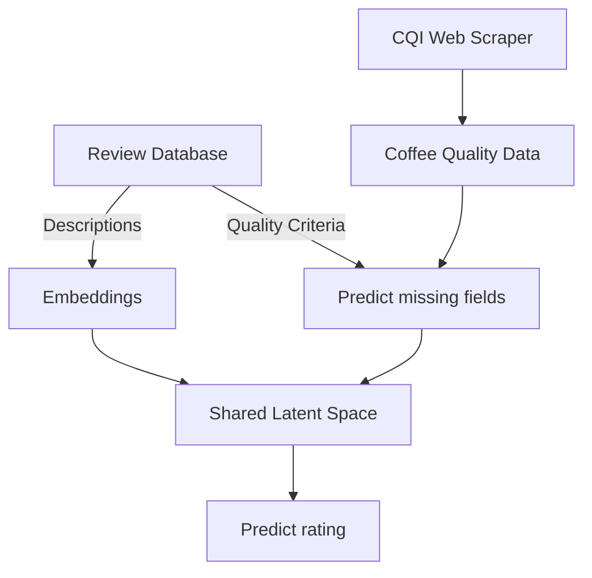

# Data processing: from notebooks to pipelines to batch processing

Everybody loves notebooks, and by now, they can do just about everything: run code, show plots, [build website, publish packages](https://nbdev.fast.ai/) - you name it.
Yet, there comes the time, when your project outgrows the notebook stage, when small-scale, interactive experiments have to be converted into automated, production-ready pipelines.

This lab is also a latent segue into a broader topic: data-centric MLOps. So far, we have almost exclusively been focussing on the machine learning _models_.
However, as you certainly know, machine learning only works with good, high quality data. This week, we start our exploration into the data-side of machine learning
by looking at how you can build and scale data processing pipelines - from notebooks to clusters.

## What you will learn

- The basics of `Kedro`, a framework for building data and ML pipelines.
- The basics of `Airflow`, a scheduler and batch processing platform.
- How to use the two to convert a notebook into a batch processing pipeline.

In this lab, you will learn about one way of converting a notebook-based experiment into a scalable pipeline.
We will start with a good old Jupyter Notebook. Then, you will be introduced to [Kedro](https://kedro.org/), a framework for building modular, maintainable pipelines from plain Python functions. Once we have created a Kedro pipeline, we will deploy it using [Airflow](https://airflow.apache.org/), a popular open-source workload scheduler.

## Motivation: why Kedro _and_ Airflow?

Kedro and Airflow solve different problems. In short: **Kedro structures your ML code into a pipeline, Airflow operates pipelines in production.**

**Kedro is for development.** It gives your code a structure - plain Python functions (nodes), a Data Catalog that takes care of all file access, and parameters in YAML. You can iterate quickly on your laptop (`kedro run`, `kedro run --nodes ...`, Kedro-Viz, notebooks), and your nodes are pure functions that are easy to test and reuse. What Kedro does _not_ decide is _when_ and _where_ the pipeline runs: `kedro run` runs it once, in a single process, on your machine.

**Airflow is for operations.** Once the pipeline has to run regularly and reliably without anyone watching, Airflow adds:

- **Scheduling** - e.g. every night at 02:00, or whenever new data arrives.
- **Retries and failure handling** - if a task fails, Airflow retries it, can alert you, and lets you re-run just that task.
- **Monitoring and history** - a web UI with every run, the duration and logs of each task, and what failed when.
- **Backfills** - re-running the pipeline for past dates.
- **Distributed execution** - tasks can run on different workers or machines (e.g. training on a GPU node).
- **Orchestration across systems** - your ML pipeline becomes one step in a larger workflow (data ingestion before it, deployment or reporting after it).

**Why not start directly with Airflow?**

- Airflow is heavyweight to develop in: you need a scheduler, a metadata database and a webserver just to test a change. That makes iterating on data science code slow.
- Airflow does not structure your ML code - there is no data catalog and no parameter management. Code written directly as DAGs tends to mix scheduling, I/O and modelling.
- A Kedro pipeline does not depend on any particular orchestrator. The same project can be exported to Airflow, Prefect, Kubeflow, Databricks, ... or just run with `kedro run`.
- Many pipelines never need Airflow. During exploration and experimentation, `kedro run` is enough - you add an orchestrator once the pipeline is stable and needs to run in production.

This is exactly the workflow of this lab: develop and debug with `kedro run` and Kedro-Viz, then generate the Airflow DAG with `kedro airflow create` once the pipeline is stable. Think of Kedro as how you write and organise the program, and of Airflow as the cron job, supervisor and dashboard that runs it in production.

## Setup

Everything in this lab runs on a laptop: the whole coffee pipeline takes well under a minute on a 4-core CPU and needs less than 2 GB of RAM (the first run downloads a small embedding model from Hugging Face, so you need an internet connection). If you prefer, you can also use your lab VM - a GPU is used automatically if available, but it is not needed.

```shell
conda env create -f lab05/env.yaml
conda activate mlops-lab-05
```

- **Windows:** Airflow does not run natively on Windows. Use [WSL](https://learn.microsoft.com/en-us/windows/wsl/install) and create the environment inside WSL, or work on the lab VM.
- **Remote VM:** the Airflow UI (port 8080) and Kedro-Viz (port 4141) run on the VM. Forward the ports to your laptop, e.g. `ssh -L 8080:localhost:8080 -L 4141:localhost:4141 <user>@<host>`.
- Kedro collects anonymous usage statistics. You can opt out with `export KEDRO_DISABLE_TELEMETRY=true`.

## Required reading

To get you up to speed with Kedro and Airflow we provide you with a short introduction to each of them.

| Required Reading |Link|
|:------------------|:---|
| Kedro 101 | [Click me](./kedro/kedro_101.md) |
| Airflow 101  | [Click me](./airflow/airflow_101.md) |

## A multi-modal coffee pipeline

Now that you are an expert pipeline builder, you deserve a treat. What better than a cup of the superior caffeinated hot beverage - coffee! Life is too short for bad coffee. So, we want to find the best one.

There are a few quality criteria that one can evaluate:

- Aroma: Refers to the scent or fragrance of the coffee.
- Flavor: The flavor of coffee is evaluated based on the taste, including any sweetness, bitterness, acidity, and other flavor notes.
- Aftertaste: Refers to the lingering taste that remains in the mouth after swallowing the coffee.
- Acidity: Acidity in coffee refers to the brightness or liveliness of the taste.
- Body: The body of coffee refers to the thickness or viscosity of the coffee in the mouth.
- Balance: Balance refers to how well the different flavor components of the coffee work together.
- Uniformity: Uniformity refers to the consistency of the coffee from cup to cup.
- Clean Cup: A clean cup refers to a coffee that is free of any off-flavors or defects, such as sourness, mustiness, or staleness.
- Sweetness: It can be described as caramel-like, fruity, or floral, and is a desirable quality in coffee.

The Coffee Quality Institute (CQI) maintains a database of coffee quality profiles and [_somebody_](https://github.com/fatih-boyar/coffee-quality-data-CQI/tree/main) already wrote a web scraper for this data.

Your coffee-addicted (but only modestly data-science-skilled) friend also stumbled upon a database of coffee reviews, that include 5 of the 9 coffee quality criteria, along with text descriptions of the coffee. They even prepared the following pipeline, for which you can find a notebook in [`coffee_analytics/coffee_analytics.ipynb`](coffee_analytics/coffee_analytics.ipynb):


```mermaid
flowchart TD
    WS[CQI Web Scraper] --> CQ[Coffee Quality Data]
    RV[Review Database] --> |Quality Criteria| M[Predict missing fields]
    CQ --> M

    RV --> |Descriptions| E[Embeddings]

    E --> LS[Shared Latent Space]
    M --> LS
    LS --> R[Predict rating]
```

The web scraper and the review database are not part of this lab - their outputs are the two CSV files in `coffee_analytics/data/`:

- **`cqi_5_23.csv` - Coffee Quality Data** (207 samples, 41 attributes): the output of the CQI web scraper. One row per coffee lot graded by the Coffee Quality Institute in 2022/2023. Besides metadata (country of origin, farm, variety, processing method, altitude, ...), it contains the scores for **all nine quality criteria** listed above (`Aroma`, `Flavor`, `Aftertaste`, `Acidity`, `Body`, `Balance`, `Uniformity`, `Clean Cup`, `Sweetness`), plus `Overall`, `Total Cup Points` and defect counts.
- **`rev_5_23.csv` - Review Database** (2440 samples, 20 attributes): coffee reviews from [coffeereview.com](https://www.coffeereview.com/), 2018 - 2023. One row per reviewed coffee, with the roaster, origin, roast level, price, an overall `rating`, and scores for only **five of the nine criteria** (`aroma`, `acid`, `body`, `flavor`, `aftertaste`). The text of each review is split into three columns: `desc_1` (the tasting notes), `desc_2` (background on the producer and the coffee) and `desc_3` (the "bottom line"). `all_text` holds the raw text of the scraped page.

The two files are linked only by the five shared criteria: the CQI data is used to learn how the four missing criteria relate to the five shared ones, and to predict them for the reviews. Note that the column names differ between the two files (e.g. `acid` vs. `Acidity`), so the notebook renames them first.

"Predict rating" is a simple downstream application of the shared latent space.

However, your friend is getting tired of running the pipeline manually. You decide to help them out and build an automated data pipeline for them.

### Tasks

#### 1. From Notebook to Pipeline

Convert the notebook into a Kedro pipeline. Make sure that the resulting pipeline has the same steps as the one in the diagram!

**a) Prepare the notebook.** Before writing any Kedro code, restructure `coffee_analytics.ipynb`  so that it maps cleanly onto the pipeline (steps 1 - 3 of the [refactoring recipe](./kedro/kedro_101.md#refactoring-notebooks)):

- Split it into sections with `##` headings, one per step in the diagram. Each section will become one node (or a few).
- For each section, note which variables it _reads_ and which it _creates_ - these become the inputs and outputs of the node.
- Define constants (`FEATURE_COLUMNS`, `MISSING_COLUMNS`, `MODEL_NAME`) in the sections that use them, and make sure no section relies on a variable that is not an output of an earlier section.
- Check that the notebook still runs from top to bottom.

**b) Build the Kedro project.** Create a new Kedro project next to the notebook:

```shell
cd lab05
kedro new --name coffee-pipeline --tools none --example no
cd coffee-pipeline
pip install -e .
kedro pipeline create feature_engineering   # create as many pipelines as you like
```

Then turn each section of your refactored notebook into a node, following the rest of the recipe in [Kedro 101](./kedro/kedro_101.md#refactoring-notebooks). A few hints:

1. **Declare the two CSV files as datasets** in `conf/base/catalog.yml`. Paths are relative to the project root, so from `lab05/coffee-pipeline` they are `../coffee_analytics/data/...`. For the CQI data:

    ```python
    # notebook (section "Data preprocessing")
    cqi_df = pd.read_csv('../coffee_analytics/data/cqi_5_23.csv')
    ```

    ```yaml
    # conf/base/catalog.yml
    cqi_raw:
      type: pandas.CSVDataset
      filepath: ../coffee_analytics/data/cqi_5_23.csv
    ```

    The review data works the same way. A node that lists `cqi_raw` as an input receives the loaded DataFrame - no `pd.read_csv` in your code.

2. **Move the global variables to parameters.** The notebook uses global variables (`FEATURE_COLUMNS`, `MISSING_COLUMNS`, `MODEL_NAME`) in several sections. Move them to `conf/base/parameters.yml` (or the `parameters_<pipeline>.yml` created by `kedro pipeline create`) and pass them to the nodes that need them. The function takes the value as a normal argument, the pipeline passes it in with the `params:` prefix. For example, the section "Missing value prediction":

    ```python
    # notebook (section "Missing value prediction")
    MISSING_COLUMNS = ["Balance", "Uniformity", "Clean Cup", "Sweetness"]
    rev_df[MISSING_COLUMNS] = xgb_model.predict(rev_df[["Aroma", "Flavor", "Aftertaste", "Acidity", "Body"]])
    ```

    ```yaml
    # conf/base/parameters.yml
    missing_columns: ["Balance", "Uniformity", "Clean Cup", "Sweetness"]
    ```

    ```python
    # nodes.py - the constant becomes an argument, rev_df and xgb_model become inputs
    def impute_missing(reviews: pd.DataFrame, imputer, missing_columns: list[str]) -> pd.DataFrame:
        ...  # see hint 3: return a new DataFrame instead of modifying `reviews`

    # pipeline.py
    Node(
        impute_missing,
        inputs=["reviews", "imputer", "params:missing_columns"],
        outputs="reviews_imputed",
        name="impute_missing",
    )
    ```

    The same applies to `FEATURE_COLUMNS` (the hard-coded list in `predict(...)` above) and `MODEL_NAME`.

3. **Return new objects instead of modifying data in place.** The notebook modifies `rev_df` in place (`inplace=True`, `rev_df[...] = ...`). Nodes should instead return new objects - otherwise you cannot tell from the pipeline which node depends on which data. For example, the renaming step:

    ```python
    # notebook (section "Data preprocessing"): changes rev_df, returns nothing
    rev_df.rename(columns={"aroma": "Aroma", ...}, inplace=True)

    # nodes.py: leaves its input untouched and returns a new DataFrame
    def preprocess_reviews(reviews_raw: pd.DataFrame) -> pd.DataFrame:
        return reviews_raw.rename(columns={"aroma": "Aroma", ...})
    ```

    If you have to assign columns (`df[cols] = ...`), work on a copy: `df = df.copy()` first, then `return df`.

4. **Load the embedding model _inside_ the embedding node**; there is no need to put it into the catalog. The node receives the model name as a parameter:

    ```python
    # notebook (section "Text embedding")
    MODEL_NAME = "TaylorAI/gte-tiny"
    ...
    tokenizer = AutoTokenizer.from_pretrained(f'{MODEL_NAME}')
    model = AutoModel.from_pretrained(f'{MODEL_NAME}')
    ```

    ```python
    # nodes.py
    def embed_descriptions(reviews: pd.DataFrame, model_name: str) -> np.ndarray:
        tokenizer = AutoTokenizer.from_pretrained(model_name)
        model = AutoModel.from_pretrained(model_name)
        ...  # the embedding code from the notebook
        return embeddings_reduced
    ```

5. **Declare every intermediate result** (DataFrames, arrays, fitted models) in the catalog. You will need this for Task 2. In the notebook, these are the variables that one section creates and a later section uses (e.g. the renamed `rev_df` or the fitted `xgb_model`) - they only exist in memory. Pick a dataset type that can store the object - `pandas.CSVDataset` for DataFrames, `pickle.PickleDataset` for anything else (arrays, fitted models, ...):

    ```yaml
    reviews:                       # output of preprocess_reviews (the renamed rev_df)
      type: pandas.CSVDataset
      filepath: data/02_intermediate/reviews.csv

    imputer:                       # a fitted model (the first xgb_model)
      type: pickle.PickleDataset
      filepath: data/06_models/imputer.pkl
    ```

    The dataset name in the catalog must match the name you use in `inputs=` / `outputs=` in the pipeline.

You are done when `kedro run` runs the whole pipeline and `kedro viz run` shows a graph with the steps from the diagram.

#### 2. ... from Pipeline to Batch Processing

Convert the Kedro pipeline into an Airflow DAG with [`kedro-airflow`](https://github.com/kedro-org/kedro-plugins/tree/main/kedro-airflow) and run it in Airflow (see the last section of [Kedro 101](./kedro/kedro_101.md#from-kedro-to-airflow)):

```shell
# in lab05/coffee-pipeline
kedro airflow create --target-dir ../airflow/dags

cd ../airflow
export AIRFLOW_HOME=$(pwd)
cd ../coffee-pipeline      # start Airflow from the Kedro project root!
airflow standalone
```

- Optionally, create a `conf/base/airflow.yml` to configure the DAG (schedule, start date, retries - see `kedro/covid-example/conf/base/airflow.yml`) and re-run `kedro airflow create`.
- Unpause and trigger the `coffee-pipeline` DAG in the UI. You are done when all tasks are green and the outputs are written to `coffee-pipeline/data/`.
- Look at the _Graph_ view: which tasks can run in parallel, and why?

Also, when debugging Airflow DAGs and tasks, there are a couple of handy features:

- Tasks generate logs. Click on a task in the _Grid_ view to see them.
- You can manually trigger DAGs by clicking the "Trigger" button in the DAG view.
- You can manually restart tasks or whole subgraphs of a DAG by "clearing them" (select a task or run in the _Grid_ view and click "Clear").
- `airflow dags test coffee-pipeline` runs the DAG once in your terminal, which makes errors much easier to read.

Typical errors:

| Error in the task log | Cause |
|:--|:--|
| `ModuleNotFoundError: No module named 'coffee_pipeline'` | The project is not installed in the Airflow environment - run `pip install -e .` in the project root. |
| `MissingConfigException: Given configuration path either does not exist or is not a valid directory: .../conf` | Airflow was not started from the Kedro project root. |
| `ValueError: Pipeline input(s) {'...'} not found in the DataCatalog` | A dataset that is passed between two tasks is not declared in the catalog (it only existed in memory in the previous task). |

#### 3. Food for thought

Pipelines make it easy to run things - but are we running the right things? Take a closer look at the data:

- Look at the distributions of `Sweetness`, `Clean Cup` and `Uniformity` in the CQI data. What does that mean for the "missing fields" we predict for the reviews?
- Compare the value ranges of the shared quality criteria (`Aroma`, `Flavor`, ...) in the CQI data and in the review data. Are they on the same scale?
- The first model is trained without a train-test split ("Look ma, no train-test split!"). How would you know whether the predicted fields are any good?

### Reference solution

A reference solution can be found in [`solution/`](solution/): the prepared notebook for Task 1a ([`solution/coffee_analytics_sol.ipynb`](solution/coffee_analytics_sol.ipynb)), the Kedro project ([`solution/coffee-pipeline`](solution/coffee-pipeline)), and the generated Airflow DAG ([`solution/coffee-pipeline/airflow_dags`](solution/coffee-pipeline/airflow_dags)). Try it yourself first!
