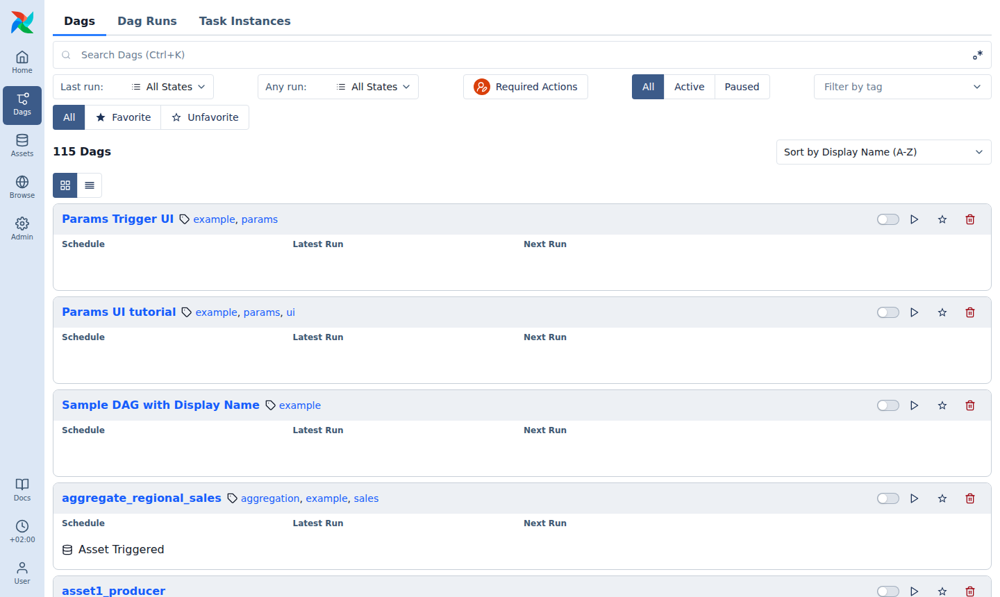
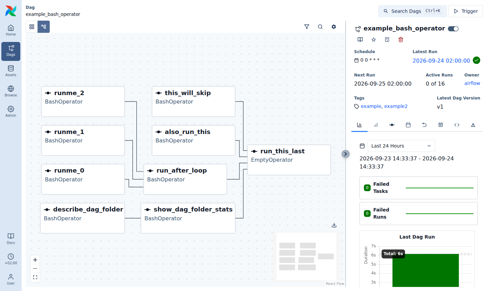

# Airflow 101 - A quick introduction to airflow

From the airflow docs:
> Apache Airflow is an open-source platform for developing, scheduling, and monitoring batch-oriented workflows. Airflow’s extensible Python framework enables you to build workflows connecting with virtually any technology. A web interface helps manage the state of your workflows. Airflow is deployable in many ways, varying from a single process on your laptop to a distributed setup to support even the biggest workflows.

In this brief introduction to airflow, we will look at how to write and test airflow pipelines.
Deploying and managing airflow is an art and science of its own, which we invite you to study on your own. :D

## Installing Airflow

Airflow is already part of the lab environment (`lab05/env.yaml` / `lab05/requirements.txt`), so if you set up the `mlops-lab-05` environment you are good to go:

```shell
conda env create -f lab05/env.yaml
conda activate mlops-lab-05
airflow version  # should print 3.3.2
```

We deliberately install Airflow into the _same_ environment as Kedro and the ML libraries: the Airflow tasks you will build later import and run your Kedro project, so everything the pipeline needs must be installed where Airflow runs.

> **Windows users:** Airflow does not run natively on Windows. Use [WSL](https://learn.microsoft.com/en-us/windows/wsl/install) (and create the conda environment inside WSL), or work on the lab VM.

<details>
<summary>Installing Airflow on its own (not needed for this lab)</summary>

An Airflow deployment has many interacting components, which must have the correct versions. For a standalone installation, the Airflow project therefore recommends installing with a constraints file that pins all dependencies to tested versions:

```shell
AIRFLOW_VERSION=3.3.2
PYTHON_VERSION="$(python -c 'import sys; print(f"{sys.version_info.major}.{sys.version_info.minor}")')"
CONSTRAINT_URL="https://raw.githubusercontent.com/apache/airflow/constraints-${AIRFLOW_VERSION}/constraints-${PYTHON_VERSION}.txt"

pip install "apache-airflow==${AIRFLOW_VERSION}" --constraint "${CONSTRAINT_URL}"
```

</details>

## Airflow in 5 minutes

Airflow is again all about pipelines (DAGs). The main characteristic of Airflow workflows is that everything is defined in python code, so there are no YAML-specs or similar configuration files - the code _is_ the spec.
"Workflows as code" serves several purposes:

- Dynamic: Airflow pipelines are configured as Python code, allowing for dynamic pipeline generation.
- Extensible: The Airflow™ framework contains operators to connect with numerous technologies. All Airflow components are extensible to easily adjust to your environment.
- Flexible: Workflow parameterization is built-in leveraging the Jinja templating engine. Built-in template variables such as `{{ ds }}` (the date of the current run) are very useful for incremental batch jobs, but use templating sparingly - heavily templated DAGs quickly become hard to read and maintain.

An Airflow installation consists of several components:

- DAG folder and DAG processor: The DAG folder holds all DAG scripts. The DAG processor parses them and stores the result in the database.
- Scheduler: The scheduler triggers workflows (DAGs) and submits their tasks to the executor.
- Executor: Executors run the tasks that make up a DAG. There are various executor implementations available, starting from the [Local Executor](https://airflow.apache.org/docs/apache-airflow/stable/core-concepts/executor/local.html), which runs tasks as processes on the same machine, to distributed ones like the [Kubernetes Executor](https://airflow.apache.org/docs/apache-airflow/stable/core-concepts/executor/index.html). You can also [write your own executor](https://airflow.apache.org/docs/apache-airflow/stable/core-concepts/executor/index.html#writing-your-own-executor).
- API server: Serves the web UI to inspect, trigger, and debug tasks and DAGs - and the API that the running tasks use to talk back to Airflow.
- Metadata database: Stores metadata, keeps the state of DAGs and tasks.

However, as mentioned in the introduction, managing Airflow is out of scope for this introduction. For us, the local airflow version is enough. You can start it with the following command:

```shell
airflow standalone
```

Airflow keeps its configuration, database, logs and DAGs in a directory called `AIRFLOW_HOME`, which defaults to `~/airflow`. DAGs are loaded from `$AIRFLOW_HOME/dags`. You can point Airflow to a different directory by setting the `AIRFLOW_HOME` environment variable - more on this later.

This command initializes the database, creates an `admin` user, and starts all the components.
Once that's done, take note of the password printed in the terminal (it is also stored in `$AIRFLOW_HOME/simple_auth_manager_passwords.json.generated`). You can access the Airflow UI by visiting `localhost:8080`.

> **Working on a remote machine (e.g. the lab VM)?** The UI runs on the machine where you started Airflow. Forward the port to your laptop, e.g. `ssh -L 8080:localhost:8080 <user>@<host>`, then open `localhost:8080` in your local browser.
>
> **Port 8080 already taken?** Change the port of the API server _and_ tell the tasks where to find it, e.g. for port 8081:
> `AIRFLOW__API__PORT=8081 AIRFLOW__CORE__EXECUTION_API_SERVER_URL=http://localhost:8081/execution/ airflow standalone`.

Head over to the _Dags_ page. It lists all DAGs in the Airflow DAG folder - in this case, all DAGs in the Airflow examples. By default, they are all paused, as you can tell from the toggle switches on the right hand side of each DAG.



Search for the `example_bash_operator`. Enable it by toggling it. It should immediately start running.
If you click on a DAG, a detailed view of the DAG will open.



As you see, there are again plenty of tabs to look at. On the left, you can switch between the _Grid_ view (the state of every task in every run) and the _Graph_ view (a nicely rendered view of the DAG, shown above).
You can also take a look at how the DAG is implemented in the _Code_ tab.

With this in mind let's take a closer look at how DAGs are implemented. Take a look at the following snippet:

```python
from datetime import datetime

# The DAG object and the @task decorator; we'll need these to define our workflow.
from airflow.sdk import DAG, task

# Operators; predefined tasks, e.g. to run a bash command
from airflow.providers.standard.operators.bash import BashOperator

# A DAG represents a workflow, a collection of tasks
# catchup=False: only run the latest interval, don't backfill every day since start_date
with DAG(dag_id="demo", start_date=datetime(2022, 1, 1), schedule="0 0 * * *", catchup=False) as dag:
    # Tasks are represented as operators
    hello = BashOperator(task_id="hello", bash_command="echo hello")

    # Tasks can also be declared using decorated python functions.
    # This is known as "taskflow".
    @task()
    def say_airflow():
        print("airflow")

    # Set dependencies between tasks
    hello >> say_airflow()
```

Here you see the following:

- A [DAG](https://airflow.apache.org/docs/apache-airflow/stable/core-concepts/dags.html) named “demo”, starting on Jan 1st 2022 and running once a day. A DAG is Airflow’s representation of a workflow.
- `catchup=False`: If catchup is enabled, Airflow schedules a run for every interval between `start_date` and today - enabling this DAG would immediately start one run for every day since 2022! `False` is the default in Airflow 3, but it was `True` in older versions, so it is good practice to set it explicitly.
- Two [tasks](https://airflow.apache.org/docs/apache-airflow/stable/core-concepts/tasks.html), a BashOperator running a Bash script and a Python function defined using the `@task` decorator. There are three types of tasks:
  - [Operators](https://airflow.apache.org/docs/apache-airflow/stable/core-concepts/operators.html), predefined task templates that you can string together quickly to build most parts of your DAGs.
  - [Sensors](https://airflow.apache.org/docs/apache-airflow/stable/core-concepts/sensors.html), a special subclass of Operators which are entirely about waiting for an external event to happen.
  - [TaskFlow-decorated](https://airflow.apache.org/docs/apache-airflow/stable/core-concepts/taskflow.html) `@task`s, which are custom Python functions packaged up as a Task.
- \>> between the tasks defines a dependency and controls in which order the tasks will be executed

You can also find this DAG in `lab05/airflow/dags/dag_snippet.py`.
Stop your current `airflow standalone` (`Ctrl+C`) and change into `lab05/airflow`. Now, restart airflow but this time with `AIRFLOW_HOME` pointing to the current working directory:

```shell
export AIRFLOW_HOME=$(pwd)
export AIRFLOW__CORE__LOAD_EXAMPLES=False
airflow standalone
```

`AIRFLOW_HOME` is the root directory for the Airflow content (it must be an absolute path). This is the default parent directory for Airflow assets such as DAGs and logs. If not specified otherwise, Airflow will search `$AIRFLOW_HOME/dags` for DAG files. In our case, this is `lab05/airflow/dags/`, so it will find `dag_snippet.py`. `AIRFLOW__CORE__LOAD_EXAMPLES=False` hides the example DAGs, so you only see your own ones. (Any Airflow config option can be set like this, using the pattern `AIRFLOW__<SECTION>__<KEY>`.)

Once you run the command, you will see a few files being created (`airflow.cfg`, `airflow.db`, `logs/`, ...). This is a fresh Airflow installation, so there is a new admin password - look it up in the terminal output or in `simple_auth_manager_passwords.json.generated`. Log in again. Our little “demo” DAG from above should be visible in the web interface.

> **Troubleshooting**
>
> - New DAG files can take up to a minute to appear in the UI. If a DAG does not show up, check for import errors (shown on the Airflow _Home_ page), or run `airflow dags list-import-errors`.
> - You can run a DAG once from the command line, without the scheduler and UI: `airflow dags test demo`. This is very handy for debugging. (In a fresh `AIRFLOW_HOME`, run `airflow db migrate` first - `airflow standalone` does this for you.)
> - Task logs are available in the UI (click on a task in the _Grid_ view) and in `$AIRFLOW_HOME/logs/`.
> - `address already in use` when starting Airflow? A previous Airflow process is still running. Stop it with `pkill -f "airflow"` (Linux / macOS / WSL) and try again.

This example demonstrated a simple Bash and Python script, but these tasks can run any arbitrary code. Think of running a Spark job, moving data between two buckets, sending an email, training a model, etc.
There's much more to be learnt about Airflow, so we invite you to play with the examples on your own.
