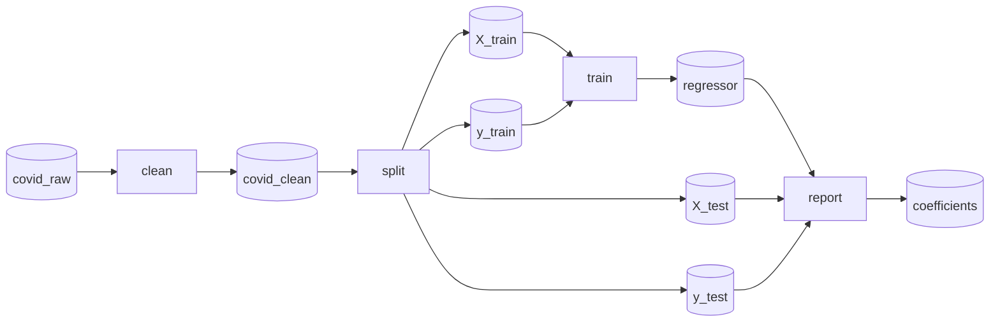
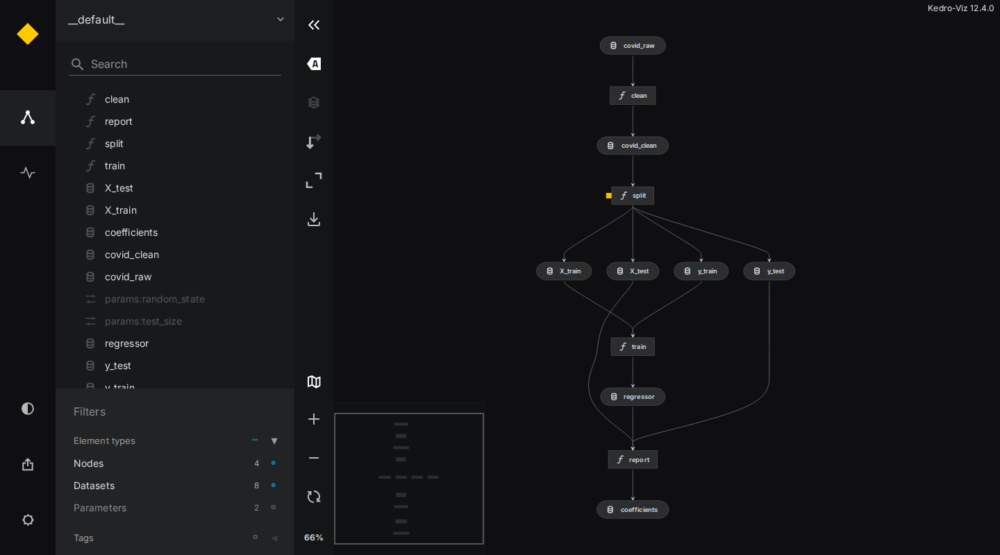

# Kedro 101

This introduction is based on the [official Kedro documentation](https://docs.kedro.org/en/stable/).

## Learning Goals

1. Basic concepts of Kedro (and pipelines in general)
2. Building Kedro pipelines
3. Refactoring notebooks into pipelines
4. Exporting a Kedro pipeline to Airflow

## Basic concepts

Until now, our discussion has centered around _pipelines_ without providing a clear definition of the term. In essence, a pipeline is a sequence of processing elements (such as processes, threads, coroutines, functions, etc.) organized in such a way that the output of each element serves as the input for the next one[1]. From a mathematical perspective, a pipeline forms a directed acyclic graph (DAG), where the nodes represent the processing elements, and the edges represent the flow of data.

[Kedro](https://kedro.org/) is an open-source Python framework for building such pipelines for data science and machine learning. It is hosted by the [LF AI & Data Foundation](https://lfaidata.foundation/) and borrows concepts from software engineering - modularity, separation of concerns, versioning - and applies them to data science code.

A Kedro pipeline is built from four ingredients:

| Concept | What it is | Where it lives |
|:--|:--|:--|
| **Node** | A plain Python function, plus the names of its inputs and outputs | `src/<package>/pipelines/<pipeline>/nodes.py` |
| **Pipeline** | A collection of nodes. Kedro works out the execution order from the inputs and outputs | `src/<package>/pipelines/<pipeline>/pipeline.py` |
| **Data Catalog** | Declares every dataset: where it is stored and how it is loaded / saved | `conf/base/catalog.yml` |
| **Parameters** | Configuration values (e.g. hyperparameters), available to nodes as `params:<name>` | `conf/base/parameters*.yml` |

The key idea: **nodes never deal with files**. A node receives Python objects (e.g. a `pandas.DataFrame`) and returns Python objects. The Data Catalog takes care of loading the inputs and saving the outputs. This keeps your functions small and testable, and lets you change where data lives (local file, S3 bucket, database, ...) without touching the code.

## A simple pipeline

Let's look at a small example project in `lab05/kedro/covid-example`. It fits a linear regression that predicts the number of positive COVID cases from the number of tests:



Rectangles are nodes, cylinders are datasets. The project has the standard Kedro layout:

```text
covid-example
├── conf
│   ├── base                  # configuration shared by everyone (committed to git)
│   │   ├── catalog.yml       # the Data Catalog
│   │   ├── parameters.yml    # parameters
│   │   └── airflow.yml       # settings for the Airflow export (see below)
│   └── local                 # your personal configuration and credentials (not committed)
├── data                      # data, organised in "layers" (01_raw, 02_intermediate, ...)
├── pyproject.toml            # makes the project an installable Python package
└── src/covid_example
    ├── pipeline_registry.py  # registers the pipelines of the project
    ├── settings.py
    └── pipelines/regression
        ├── nodes.py          # the functions
        └── pipeline.py       # how the functions are wired together
```

### Nodes and pipelines

The nodes are ordinary Python functions (`src/covid_example/pipelines/regression/nodes.py`):

```python
def clean(covid_raw: pd.DataFrame) -> pd.DataFrame:
    data = covid_raw.copy()
    for col in ["Cases", "Tests"]:
        data[col] = pd.to_numeric(data[col].astype(str).str.replace(",", ""))
    return data


def split(covid_clean: pd.DataFrame, test_size: float, random_state: int):
    X = covid_clean["Tests"].to_numpy().reshape(-1, 1)
    y = covid_clean["Cases"].to_numpy().reshape(-1, 1)
    return train_test_split(X, y, test_size=test_size, random_state=random_state)
```

The pipeline wires them together by _dataset names_ (`pipeline.py`):

```python
def create_pipeline(**kwargs) -> Pipeline:
    return Pipeline(
        [
            Node(clean, inputs="covid_raw", outputs="covid_clean", name="clean"),
            Node(
                split,
                inputs=["covid_clean", "params:test_size", "params:random_state"],
                outputs=["X_train", "X_test", "y_train", "y_test"],
                name="split",
            ),
            ...
        ]
    )
```

The output `covid_clean` of `clean` is the input of `split`, so Kedro knows that `clean` has to run first. `params:test_size` refers to the value in `conf/base/parameters.yml`. Pipelines placed in `src/<package>/pipelines/` are found automatically; `__default__` is the sum of all of them.

### The Data Catalog

`conf/base/catalog.yml` tells Kedro how to load and save each dataset:

```yaml
covid_raw:
  type: pandas.CSVDataset
  filepath: data/01_raw/covid_daily_testing.csv

regressor:
  type: pickle.PickleDataset
  filepath: data/06_models/regressor.pkl
```

The dataset types come from the [`kedro-datasets`](https://docs.kedro.org/projects/kedro-datasets/en/latest/) package, which supports pandas, Polars, Spark, images, pickles, SQL, ... Datasets that are **not** listed in the catalog are kept in memory and are lost once `kedro run` finishes. We will see why this matters when we move to Airflow.

### Running the pipeline

```shell
conda activate mlops-lab-05
cd lab05/kedro/covid-example
kedro run
```

Kedro loads `covid_raw`, runs the four nodes in the right order and saves every dataset declared in the catalog. Look at `data/08_reporting/coefficients.csv` for the result.

> Kedro collects anonymous usage statistics and prints a notice about it on every command. You can opt out with `export KEDRO_DISABLE_TELEMETRY=true` (add it to your shell profile to make it permanent).

You don't always have to run the whole pipeline:

```shell
kedro run --nodes report            # only run the `report` node (its inputs are loaded from disk)
kedro run --from-nodes train        # run `train` and everything downstream of it
kedro run --pipeline regression     # run a specific pipeline
kedro registry list                 # list all registered pipelines
```

Unlike `make`, Kedro does **not** skip up-to-date nodes automatically - use the options above to run only what you need.

### Visualising the pipeline

[Kedro-Viz](https://docs.kedro.org/projects/kedro-viz/en/stable/) renders your pipeline as an interactive graph:

```shell
kedro viz run
```

This opens `http://localhost:4141` in your browser (on a remote machine, forward the port with `ssh -L 4141:localhost:4141 <user>@<host>` and use `kedro viz run --no-browser`).



## Creating a new project

```shell
kedro new --name my-project --tools none --example no
cd my-project
pip install -e .                               # install the project as a Python package (needed for Airflow)
kedro pipeline create data_processing          # scaffold src/my_project/pipelines/data_processing/
```

`kedro pipeline create` generates empty `nodes.py` and `pipeline.py` files, a `conf/base/parameters_data_processing.yml` and a test skeleton. You don't need to create the `data/` folders - Kedro creates them when it saves a dataset.

## Refactoring notebooks

Kedro has no automatic notebook converter, but the recipe is always the same:

1. **Find the steps.** Split your notebook into logical sections (e.g. with `##` headings). Each section becomes one node (or a few).
2. **Turn cells into functions.** A function's arguments are the variables the section _reads_, its return values are the variables it _creates_ that later sections need.
3. **Replace global variables with parameters.** Constants such as column lists, model names or hyperparameters go into `parameters.yml` and are passed as `params:<name>`.
4. **Replace file access with catalog entries.** `pd.read_csv("data/...")` becomes a catalog entry, and the node receives a DataFrame instead.
5. **Wire everything together** in `pipeline.py` and check the graph with `kedro viz run`.

## From Kedro to Airflow

The [`kedro-airflow`](https://github.com/kedro-org/kedro-plugins/tree/main/kedro-airflow) plugin converts a Kedro pipeline into an Airflow DAG with one Airflow task per Kedro node. Let's try it with the example project (read the [Airflow 101](../airflow/airflow_101.md) first if you have never used Airflow):

```shell
cd lab05/kedro/covid-example
pip install -e .                                 # Airflow imports the project as a Python package
kedro airflow create --target-dir ../../airflow/dags
```

This writes `lab05/airflow/dags/covid_example_dag.py`. The DAG settings (schedule, start date, retries, ...) are taken from `conf/base/airflow.yml` - re-run `kedro airflow create` whenever you change it or the pipeline.

Three things are important:

- **Every task runs in its own process.** Datasets that only live in memory are gone once a task is finished, so the next task cannot load them. Make sure **every dataset that is passed between nodes is declared in the catalog**.
- **Airflow must run in an environment where your project is installed** (hence `pip install -e .`). In this lab, Airflow and Kedro share the `mlops-lab-05` environment.
- **Start Airflow from the project root.** The generated DAG uses the current working directory as the Kedro project path (to find `conf/` and `data/`):

  ```shell
  cd lab05/airflow
  export AIRFLOW_HOME=$(pwd)        # must be an absolute path
  cd ../kedro/covid-example
  airflow standalone
  ```

The DAG shows up as `covid-example` in the Airflow UI (the DAG id is derived from the project name). You can also run it once from the command line, without the UI: `airflow dags test covid-example` (in a fresh `AIRFLOW_HOME`, run `airflow db migrate` first - `airflow standalone` does this for you).

[1]: https://en.wikipedia.org/wiki/Pipeline_(software)
