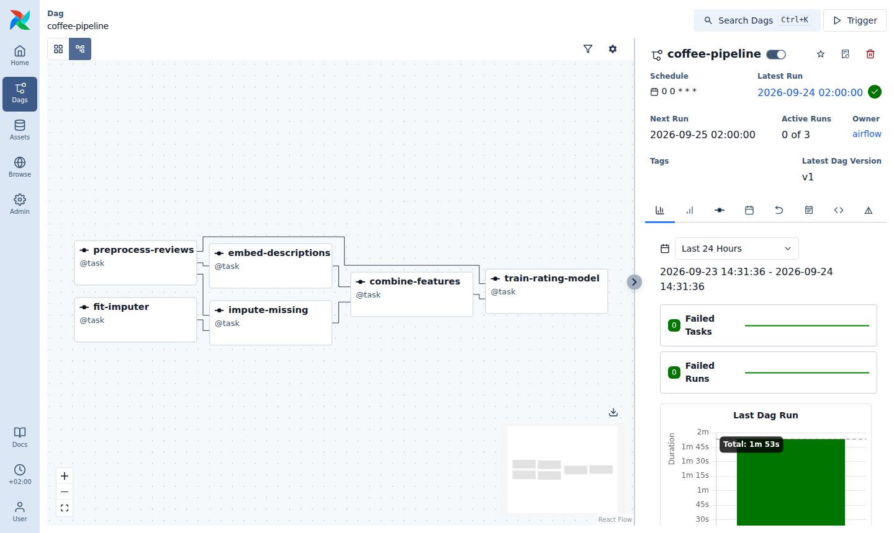

# coffee-pipeline (reference solution)

[](https://kedro.org)

Reference solution for the [lab 05 tasks](../../README_lab05.md#tasks): the [coffee analytics notebook](../../coffee_analytics/coffee_analytics_sol.ipynb) as a Kedro project, exported to Airflow.

## Pipelines

| Pipeline | Nodes | Diagram step |
|:--|:--|:--|
| `feature_engineering` | `preprocess_reviews` | Review Database (rename the quality criteria) |
| | `fit_imputer`, `impute_missing` | Predict missing fields |
| | `embed_descriptions` | Embeddings |
| | `combine_features` | Shared Latent Space |
| `rating_model` | `train_rating_model` | Predict rating |

`__default__` runs both. The raw data is read directly from `lab05/coffee_analytics/data/` (see `conf/base/catalog.yml`), all intermediate results are persisted in `data/`, and the constants of the notebook are in `conf/base/parameters.yml`.

## Run it with Kedro

```shell
conda activate mlops-lab-05
cd lab05/solution/coffee-pipeline
pip install -e .

kedro run                          # the whole pipeline
kedro run --pipeline rating_model  # only the downstream model (needs the outputs of feature_engineering)
kedro viz run                      # visualise the pipelines
cat data/08_reporting/rating_metrics.csv
```

## Run it with Airflow

The DAG in `airflow_dags/` was generated with `kedro airflow create` (settings in `conf/base/airflow.yml`). To run it, point Airflow's DAG folder to it and start Airflow from the project root:

```shell
cd lab05/airflow
export AIRFLOW_HOME=$(pwd)
cd ../solution/coffee-pipeline
export AIRFLOW__CORE__DAGS_FOLDER=$(pwd)/airflow_dags
airflow standalone
```

Then unpause the `coffee-pipeline` DAG in the UI (`localhost:8080`). As `catchup` is disabled, Airflow immediately starts a run for the most recent day only.



`embed_descriptions` does not depend on the imputation, so Airflow runs it in parallel to `fit_imputer` / `impute_missing`.
